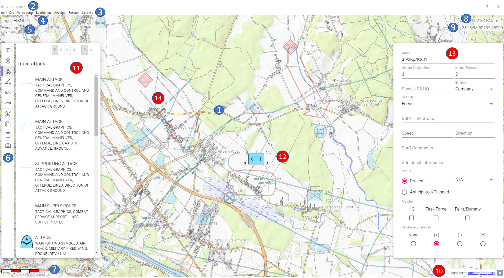

# **Benutzeroberfläche**

Nach dem erstmaligen Start von ODIN, seht Ihr folgende Benutzeroberfläche (als Standard wird diese in der englischen Sprache geöffnet):

- 1  Karte (Open Street Map) als zentrales Element von ODIN
- 2 aktuellen Projektnamen (in der Titelleiste)
- 3 Menüleiste
- 4 aktuellen Projektnamen (auf der Karte)
- 5 den aktiven Layer
- 6 Activity Bar
- 7 Maßstabbalken
- 8 aktuelle Datumsangabe (in NATO-Format)
- 9 die Koordinatenanzeige (bezogen auf die aktuelle Position des Mauszeigers)
- 10  den Button zum Öffnen der Anzeige der aktuell genutzten Karte

Nachstehend ein Beispiel mit deutscher Benutzeroberfläche und mit einer Lage:

Zusätzlich (rot markiert) sind hier weitere folgende Bereiche bzw. Funktionen sichtbar:

- 10 Anzeige der aktuell genutzten Karte (wenn Button geöffnet wurde)
- 11 Activity Bar – z.B. hier mit geöffnetem Bereich der „Map-Palette“
- 12 aktiv ausgewähltes (markiertes) Feature auf der Karte
- 13 Eigenschaftsfenster zum aktiv ausgewählten Feature
- 14 nicht aktiv ausgewählte Features werden „ausgeblasst“ auf der Karte dargestellt

In **weiterer Folge** erfolgt die **Beschreibung** der einzelnen Bereiche, Funktionalitäten etc. mit der **deutschen Benutzeroberfläche**!

Um das **Benutzerhandbuch schlank zu halten** bzw. auf die **nützlichsten Bereiche, ** **Funktionen** etc. zu **beschränken**, werden **selbsterklärende Funktionen** (z.B. Odin beenden, Minimieren/Maximieren etc.) **in diesem Benutzerhandbuch** **nicht gesondert** erklärt**!

