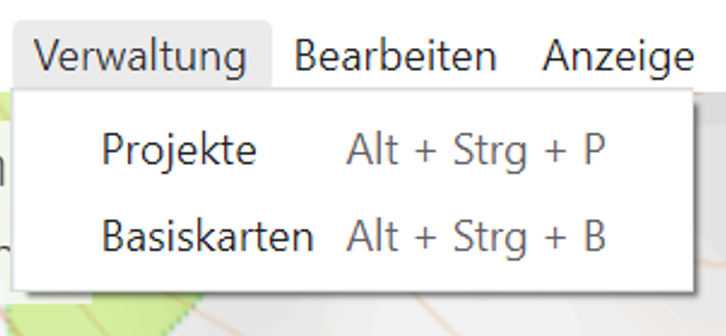

 ---
weight: 14
draft: false
---

# **Kartenverwaltung**

In der Kartenverwaltung könnt Ihr Online- bzw. Offlinekarten in ODIN einbinden bzw. wieder löschen. Die hier erstellten Karten sind dann in ODIN im Bereich der „Activity Bar – Basiskarten“ verfügbar.

Die Kartenverwaltung ist über die **„Menüleiste – Register Verwaltung – Basiskarten“** aufrufbar:

## **Inhalt Kartenverwaltung**

Die Kartenverwaltung enthält folgende Funktionalitäten:

- 1 Verlassen/Beenden der Kartenverwaltung (= Rückkehr zur Karte)
- 2 Auflistung aller dzt. eingebundenen Online-/Offlinekarten
- 3 neue Karte einbinden
- 4 aktuell markierte Karte
- 5 Kartenvorschau der aktuell markierten Karte
- 6 Vergrößern/Verkleinern der Kartenansicht (inkl. Verschieben mit der Maus)
- 7 Bearbeiten/Verändern einer bestehenden Karte
- 8 Karte löschen

Mit dem Button **„Neu“** könnt Ihr eine **neue Karte** (Online/Offline) in ODIN einbinden.

In der Kartenvorschau könnt ihr mit den beiden Buttons **„+“** / **„-“** (oder mit dem Mausrad) die Karte zoomen bzw. mit der Maus die Karte auch verschieben.

Mit dem **„Stift“**-Button könnt Ihr die **Eingaben** zu einer bereits **erstellten Karte** (z.B. Name, Karten-URL etc.) **ändern**.

Mit dem Button **„Löschen“** wird die aktuell markierte **Karte** aus der Kartenverwaltung **gelöscht**.

Die **Open Street Map** scheint **nicht in der Kartenverwaltung** auf, da diese die **„System-/Standard“-Karte** von ODIN ist.

## **Neue Karte in ODIN einbinden**

Für die Einbindung einer neuen Online-/Offline-Karte in ODIN sind folgende vier Schritte notwendig (als Beispiel wird hier die Einbindung der Karte „basemap.at“ dargestellt):

### **Schritt 1 – URL bereitstellen**

- 1 Verlassen/Beenden der Kartenverwaltung (= Rückkehr zur Karte)

- 2 Anzeige Fortschritt der Karteneinbindung

- 3 Bereich zur Eingabe der URL

- 4 Information ob eingegebene Karten-URL korrekt/verarbeitbar ist

- 5 Einbindung Schritt zurück *(hier immer inaktiv)*

- 6 Einbindung Schritt weiter

- 7 Kartenvorschau *(hier immer leer)*

- 8 Karteneinbindung abbrechen (= Rückkehr zur Kartenverwaltung)

- 9 Karte löschen* *(hier immer inaktiv)*

Wird im Bereich **„URL der Karte“** eine **Karten-URL eingegeben**, erfolgt die Rückmeldung, ob die Karten-URL korrekt bzw. verarbeitbar ist und der Button **„Weiter“** wird aktiv geschalten:

### **Schritt 2 – Optionen wählen**

- 1 Verlassen/Beenden der Kartenverwaltung (= Rückkehr zur Karte)
- 2 Anzeige Fortschritt der Karteneinbindung
- 3 Information zur Karte (z.B. Quelle, Homepage, Beschreibung etc.)
- 4 Anzeige der verfügbaren Karten inkl. kurzer Beschreibung des Inhaltes
- 5 Anzeige wie viele Karten von den insgesamt verfügbaren Karten angezeigt werden
- 6 Einbindung Schritt zurück
- 7 Einbindung Schritt weiter
- 8 Kartenvorschau *(hier immer leer)*
- 9 Karteneinbindung abbrechen (= Rückkehr zur Kartenverwaltung)
- 10 Karte löschen* *(hier immer inaktiv)*

Wird eine **Karte** durch Markieren mit der Maus **ausgewählt**, wird diese rosa hinterlegt.

Mit den Buttons **„&lt;“** und **„&gt;“** könnt Ihr zu den nächsten möglichen Karten weiter oder wieder zurück wechseln, um diese auszuwählen.

Anstelle der oben angeführten Ansicht kann es im Schritt 2 auch der Fall sein, dass hier anstelle der Kartenauswahl der anzuzeigende **Zoomfaktor** für die Karte **genauer definiert** werden kann:

Durch die **Eingabe** der maximal unterstützten **Zoom-Stufe** (für jene Karten die einen XYZ-Tile-Provider verwenden, diesen jedoch nicht bis zum Level 42 unterstützen), könnt Ihr somit eine "weiße Kartenansicht" in ODIN damit vermeiden.

### **Schritt 3 – Mit Vorschau überprüfen**

- 1 Verlassen/Beenden der Kartenverwaltung (= Rückkehr zur Karte)

- 2 Anzeige Fortschritt der Karteneinbindung

- 3 Einbindung Schritt zurück

- 4 Einbindung Schritt weiter

- 5 Kartenvorschau

- 6 Vergrößern/Verkleinern der Kartenansicht (inkl. Verschieben mit der Maus)

- 7 Karteneinbindung abbrechen (= Rückkehr zur Kartenverwaltung)

- 8 *Karte löschen* *(hier immer inaktiv)*

Hier könnt Ihr im Bereich der Kartenvorschau durch Zoomen und Verschieben der Karte den **Inhalt** der Karte und deren **grafische Darstellung**, sowie die darin zur Verfügung gestellten **Karteninformationen überprüfen**:

### **Schritt 4– Benennen und Speichern**

- 1 Verlassen/Beenden der Kartenverwaltung (= Rückkehr zur Karte)

- 2 Anzeige Fortschritt der Karteneinbindung

- 3 Bezeichnung der Karte festlegen

- 4 Namensnennung der Karte festlegen

- 5 Einbindung Schritt zurück

- 6 Karteneinbindung abschließen

- 7 Kartenvorschau

- 8 Vergrößern/Verkleinern der Kartenansicht (inkl. Verschieben mit der Maus)

- 9 Karteneinbindung abbrechen (= Rückkehr zur Kartenverwaltung)

- 10 *Karte löschen* *(hier immer inaktiv)*

Im Bereich **„Bezeichnung der Karte“** könnt Ihr einen **Namen** für eure **neu eingebundene Karte** **vergeben**. Dieser Name wird dann in der Activity Bar im Bereich der Basiskarten angezeigt.

Im Bereich **„Namensnennungen“** könnt Ihr zusätzlich zum Kartennamen auch noch die **„Quelle“** der **Karte angeben**, um so bei der Nutzung keine „rechtlichen Probleme“ zu bekommen, da bei den meisten (auch kostenlosen) Online-/Offline-Karten zumindest die „Quelle“ angegeben werden muss.

Vor der Einbindung von Karten, solltet ihr immer die Nutzungsbedingungen dazu überprüfen, ob eine (kostenlose) Nutzung möglich ist. Entsprechende Einträge zu den von uns bereits geprüften Onlinekarten findet Ihr im Annex A (Übersicht - Kostenlose Onlinekarten). Mit Kopieren & Einfügen könnt Ihr diese im Bereich **„Namensnennungen“** leicht einfügen.

Mit Drücken des Buttons **„Speichern“ schließt** Ihr den Vorgang der **Karteneinbindung** **ab** und ODIN kehrt zum Bereich der Kartenverwaltung zurück. Eure neu eingebundene Karte scheint nun auf der linken Seite in der Auflistung der verfügbaren Karten auf.

