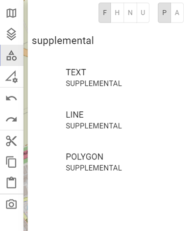
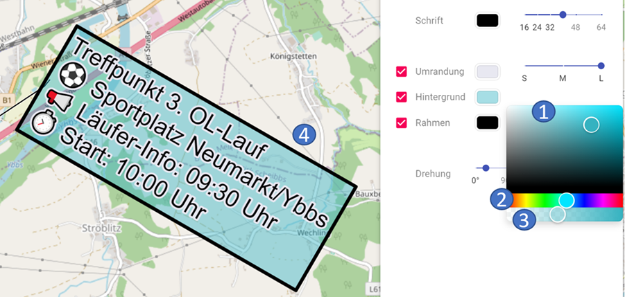

 

# **Freiformobjekte:**

Derzeit sind folgende **Freiformobjekte** in ODIN verfügbar:

- Textfeld
- Linie
- Fläche

## **Auswahl in der Map-Palette:**

Um ein **Freiformobjekt erstellen** zu können, müsst Ihr dieses in der **Map-Palette** zuerst auswählen. Gebt hiezu im Suchbereich den Begriff **"Supplemental"** ein:

## **Textfeld:**

Nach der **Auswahl** in der **Map-Palette** und dem **Klick** auf die gewünschte **Position** auf der **Karte** erscheint ein **"roter Punkt"** und das Eigenschaftsfenster wird geöffnet.

Beim Textfeld können derzeit folgende Eigenschaften eingegeben werden:

|  |  |
| -------------------------- | -------------------------- |

\- 1 markiertes Objekt auf der Karte

\- 2 aktueller Bereich Eigenschaften

\- 3 Wechseln zum Bereich für Links/WebLinks

\- 4 Name des Objektes *(= Anzeige im Layermanagement)*

\- 5 Eingabe des Textes *(= Anzeige auf der Karte)*

\- 6 Stylingmöglichkeiten für die Schrift (Farbe, Schriftgröße)

\- 7 Stylingmöglichkeiten für die Umrandung (Farbe, Breite)

\- 8 Stylingmöglichkeiten für den Hintergrund (Farbe)

\- 9 Stylingmöglichkeiten für den Rahmen (Farbe, Breite)

\- 10 Drehung der Anzeige des Textes auf der Karte

Im Freitextfeld können neben Texteingaben auch **Emojis** hinzugefügt werden (bei Windows mit der `WINDOWS-Taste` + `.` bzw. bei MAC mit `CMD` + `ALT` + `Leertaste`). Längere Texte können mit der `ENTER-Taste`  auch in Absätze gegliedert werden.

Bei der **Schrift** kann die **Farbe** ausgewählt, sowie die **Schriftgröße** geändert werden (auf die Schriftgröße 16, 24, 32, 40, 48, 56, 64).

Bei Auswahl der **Umrandung** kann dem Text eine farbige Umrandung hinzugefügt werden. Hier könnt Ihr die **Farbe** und die **Breite** (Small, Medium, Large) der Umrandung festlegen.

Bei Auswahl des **Hintergrundes** wird die **Füllfarbe** des Textfeldes festgelegt.

Bei Auswahl des **Rahmens** wird dem Textfeld ein Rahmen hinzugefügt.  Hier könnt Ihr die **Farbe** und die **Breite** (Small, Medium, Large) des Rahmes festlegen.

Mit **Drehung** könnt Ihr die **Ausrichtung** des Textfeldes (jeweils in 15 °-Schritten) ändern.

Bei der **Auswahl** der **Farben** öffnet sich ein kleines Fenster mit folgenden Auswahlmöglichkeiten:

\- 1 Auswahl der Farbe *(mittels der Maus)*

\- 2 Auswahl der Farbbereiche *(mittels der Maus)*

\- 3 Auswahl der Transparenz *(mittels der Maus)*

\- 4 unmittelbare Anzeige der Auswahl beim Objekt auf der Karte

Um die **Position** des Freitextfeldes zu **ändern**, klickt Ihr dieses mit der Maus auf der **linken Seite des Textfeldes** an und verschiebt es auf die neue gewünschte Position.

Beim Textfeld sind die gleichen Funktionalitäten wie bei den Punktsymbolen möglich, d.h.  **"Offset Location"** (`ALT-Taste` gedrückt halten und Textfeld mit der Maus verschieben), sowie **Kopieren** (`STRG` + `C`) und **Einfügen** (`STRG` + `V`) sind auch hier möglich.

## **Linie:**

Nach der **Auswahl** in der **Map-Palette** und den **Klicks** auf die gewünschte **Positionen** auf der **Karte** beendet Ihr die Eingabe mit einem **Doppelklick**, danach wird das Eigenschaftsfenster geöffnet.

Bei der Freiform "Linie" können derzeit folgende Eigenschaften eingegeben werden:

|  |  |
| -------------------------------- | -------------------------------- |

\- 1 markiertes Objekt auf der Karte

\- 2 aktueller Bereich Eigenschaften

\- 3 Wechseln zum Bereich für Links/WebLinks

\- 4 Name des Objektes *(= Anzeige im Layermanagement)*

\- 5 Stylingmöglichkeiten für die Linie (Farbe)

Die Auswahlmöglichkeiten bei der **Farbauswahl** sind **analog** wie beim **Freitextfeld**.

## **Fläche:**

Nach der **Auswahl** in der **Map-Palette** und den **Klicks** auf die gewünschte **Positionen** auf der **Karte** beendet Ihr die Eingabe mit einem **Doppelklick**, danach wird das Eigenschaftsfenster geöffnet.

Bei der Freiform "Fläche" können derzeit folgende Eigenschaften eingegeben werden:

|  |  |
| --------------------------------- | --------------------------------- |

\- 1 markiertes Objekt auf der Karte

\- 2 aktueller Bereich Eigenschaften

\- 3 Wechseln zum Bereich für Links/WebLinks

\- 4 Name des Objektes *(= Anzeige im Layermanagement)*

\- 5 Stylingmöglichkeiten  für den Rahmen (Farbe)

\- 6 Stylingmöglichkeiten für den Hintergrund (Farbe)

Die Auswahlmöglichkeiten bei der **Farbauswahl** sind **analog** wie beim **Freitextfeld**.

