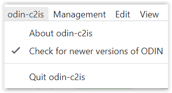
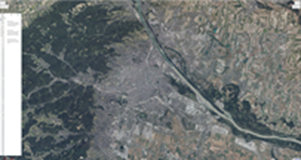

# Menu bar

The menu bar currently consists of the following tabs:

## **ODIN-C2IS**

If you have activated the function **"Check for new versions "**, ODIN checks after every start, if there is a new version available on the homepage of ODIN (<https://odin.syncpoint.io/>).

If this is the case, a window appears, in which you have the possibility to update your ODIN version to the new version or to continue working with the previous version:

If you confirm that ODIN should be updated, you don't have to do anything else but wait until ODIN closes the previous version and restarts with the current version. The current settings (project, layer, map section etc.) will be preserved after the restart.

## **Administration**

With selection of **"Projects "** you open the project administration, in which you can create, rename, delete, export, import or change to another project (details see project administration).

Selecting **"Base maps "** opens the "Map administration", where you can integrate online and offline maps and use them in ODIN (details see Map administration).

## **Edit**

The typical Windows functionalities are shown here. These are also available from the Activity Bar.

## **Display**

The function **"Developer tools on/off "** is basically not relevant for you. If there are problems in the use and you need support, then it may be that we will ask you to provide us with more information about this function, so that we can help you further.

With **"Zoom in "** (`STRG` + `SHIFT` + `=`) and **"Zoom out "** (`STRG` + `-`) the display area of the map itself, but also the displays on it (e.g. activity bar, scale, project/layer name etc.) can be zoomed in or out. With "Original size" (`STRG` + `0`) you can return to ODIN's default setting:

|  |  |  |
| :------------------------------: | :------------------------------: | :------------------------------: |
|           (zoomed in)            |         (original size)          |           (zoomed out)           |

With the function **"MGRS Grid "** you can show or hide a MGRS (Military Grid Reference System) grid on all your maps used in ODIN (e.g. also on orthophoto maps) worldwide:

|  |  |
| :------------------------------: | :------------------------------: |

With the function **"Labels "** you can choose in ODIN if the modifiers should be shown with the features on the map or not:

|  |  |
| :--------------------------------: | :--------------------------------: |
|           (labels shown)           |          (labels hidden)           |

## **Windows**

## **Language**

Here you can switch the display of the functions, tooltips etc., which concern the **user interface** between **"German "** and **"English "**.

