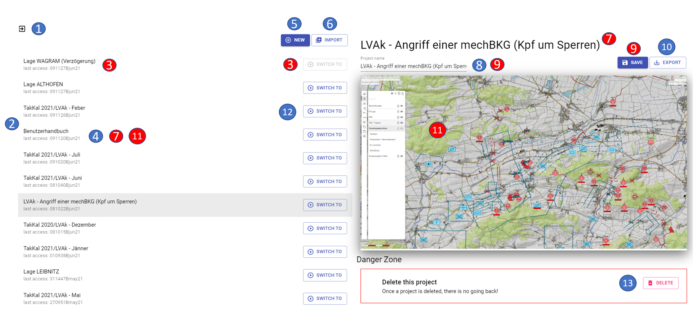

# **Project management**

The project administration can be called up via the "Menu bar - Administration tab - Projects":

## **Content project management**

The project management contains the following functionalities:

- 1 exit the project management (= return to the map)
- 2 listing of all existing projects

- 3 current project

- 4 currently marked project

- 5 create new project

- 6 import project

- 7 display name of currently marked project

- 8 rename project

- 9 save project (= confirm rename)

- 10 export project

- 11 preview project content

- 12 switch project

- 13 delete project

The **current project** is always at the first position in the order of the projects and the button to switch to this project is therefore "grayed out".

If you mark a **different project**, it will be grayed out. In addition, the name of the project is displayed at the top of the right pane and in the field for renaming, and a corresponding preview is available as an "orientation aid".

With the button **"New"** you can create a **new project**.

With the button **"Import "** you can import a **project**. After pressing the button **"Import "** the explorer opens, in which you can select your desired project. After the import the imported project is displayed in the project overview on the left side.

Above the project preview you can rename an existing **project**. The **change** of the project name is to be **confirmed** by pressing the **"Save "** button or with the `ENTER` key.

With the button **"Export"** you can export** a **project. After pressing the button **"Export "** the explorer opens, in which you can save your project. If you want to export only one layer, use the function "Share Layer" in the layer management.

With the button **"Switch to"** you can switch to the desired **project** (the project management will be closed automatically and the other project will be opened).

With the button **"Delete"** the currently marked **project** will be irretrievably **deleted**. If you are not sure whether you might need this project again, you should export the project before deleting it to have it available again if necessary.

## **Create new project**

After pressing the **"NEW "** button, the following view appears in the right pane:

- 1 "untitled project (= display of the project name)
- 2 rename project

- 3 save project (= confirm rename)

- 4 export project

- 5 delete project

The new project will be created with the name "untitled project". By pressing the **"Save "** button or the `ENTER` key, the project name is changed and the new project name is displayed.

By pressing the **"Delete "** button, the new project to be created is "discarded" and thus not included in the selection list of available projects. Furthermore, the "New project" window is closed and the view of the project administration is returned to.

