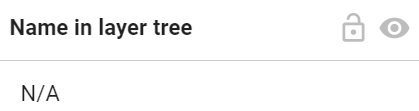
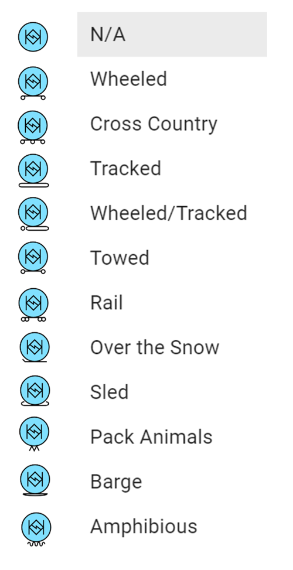
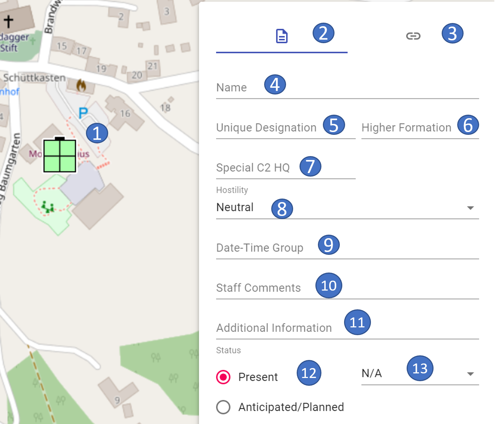
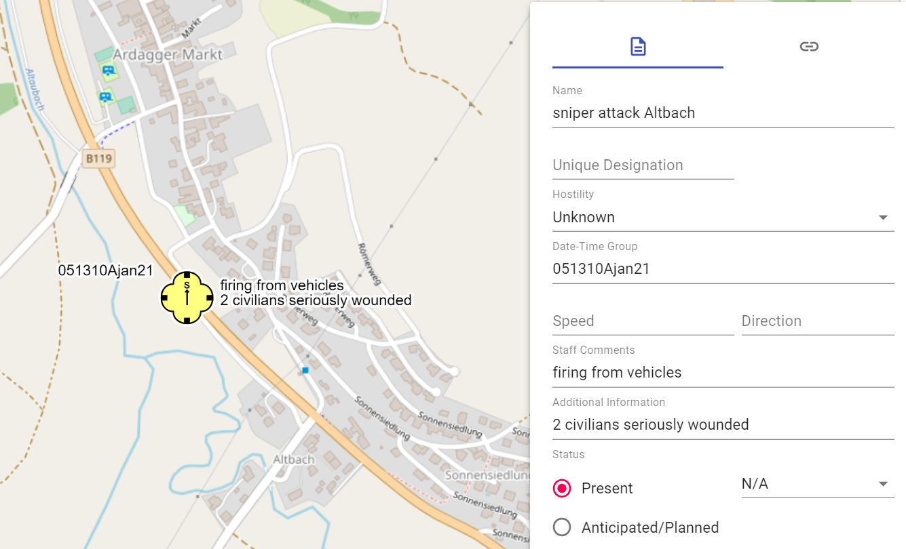

# **Property windows of objects**

The content of the property windows is loosly derived from **MIL-STD 2525C** (= assignment of the corresponding modifiers). However, not all modifiers are **available** in ODIN (e.g. Offset Location, Evaluation Rating etc.)

For those **symbols** (e.g. Natural Events, Action Points, etc.) that are **not specifically assigned** modifiers according to MIL-STD 2525C, we have added a **"basic set"** of properties so that you can at least enter the **most basic information** about them.

We have also included **modifiers**, which are not assigned according to MIL-STD 2525C, but which make sense from a tactical point of view (e.g. modifier "Special C2 HQ" for facilities such as TÜA, BMLV, MilKdoK etc.)

As soon as you confirm an entry in the properties window or select another field, the **display** of the entry **immediately** takes place on the **map** (if the modifier is to be displayed on the map according to MIL-STD 2525C).

## **Input fields that are the same for different object areas**

The fields below are included in various property windows, provide different choices, and are therefore described separately here:

The field **"Name"** or if this field is empty, then the field **"Unique Designation "** will be displayed in the "Layer Tree" (at Layer Management). If both fields are empty, the display in the "Layer Tree" will show **"N/A"** (not available):

|  |  |
| :------------------------------------: | :------------------------------------: |
|  |  |
|  |  |

In the **"Hostility Status"** field you can select the following information for the object in a drop-down menu:

For tactical graphics, "ENY" is displayed on the map if the Hostility Status **"Hostile"** is selected and the modifier "N" (Enemy) is provided for the respective object according to MIL-STD 2525C.

If the Hostility Status **"N/A"** is selected for Units, Weapons - Vehicles - Equipment, Facilities and Activities, the object currently disappears from the map. The tactical graphics can now be displayed in black color on the map with the hostility status **"N/A"** (e.g. in plans etc.):

With **"Present"** and **"Anticipated/Planned"** you can define whether the object should be displayed solid or dashed on the map:

In the **"Echelon"** field you can select the following sizes for the object in a drop-down menu:

In the **"Operational Conditions"** field, you can select the following information for the object from a drop-down menu:

## **Units**

The following properties can be entered for the units:

|  |  |
| -------------------------------------- | -------------------------------------- |

- 1 marked object on the map
- 2 current area properties
- 3 switch to the links/weblinks area
- 4 name of the object
- 5 own name
- 6 superior department(s)
- 7 Special C2 HQ
- 8 size symbol
- 9 hostility status
- 10 date and time information
- 11 speed
- 12 direction
- 13 staff comment
- 14 additional information
- 15 reported/planned
- 16 operational conditions
- 17 modifiers for command, battle group, and deception
- 18 modifier for indication of reinforced/reduced/mixed

You can use the **"Special C2 HQ"** field to represent units whose designation is shown in the art symbol:

The fields **"Date-Time-Group"**, **"Speed"**, **"Direction"**, **"Staff Comments"** and **"Additional Information"** are free text fields.

Using the modifiers **"HQ"** (Command Post), **"Task Force"** (Combat Group), and **"Feint/Dummy"** changes the unit's display as follows:

With the modifiers **"None"** (normal strength), **"(+)"** (reinforced), **"(-)"** (reduced) and **"(±)"** (mixed), the representation of the unit changes as follows:

The detailed information about the second section of the properties window can be found in the links/weblinks section.

## **Weapons, Vehicles and Equipment**

The following properties can be entered for weapons, vehicles and equipment:

|  |  |
| ---------------------------------------- | ---------------------------------------- |

- 1 marked object on the map
- 2 current area properties
- 3 switch to the links/weblinks area
- 4 name of the object
- 5 own name
- 6 number
- 7 type
- 8 mobility
- 9 hostility status
- 10 date and time information
- 11 speed
- 12 direction
- 13 staff comment
- 14 additional information
- 15 reported/planned
- 16 operational conditions

In the **"Mobility"** field, you can select the following information for the object from a drop-down menu:

The fields **"Quantity"**, **"Type"**, **"Date-Time-Group"**, **"Speed"**, **"Direction"**, **"Staff Comments"** and **"Additional Information"** are free text fields.

The detailed information for the second section of the properties window can be found in the links/weblinks section.

## **Installations**

The following properties can be entered for the installations:

|  |  |
| ------------------------------------------ | ------------------------------------------ |

- 1 marked object on the map
- 2 current area properties
- 3 switch to the links/weblinks area
- 4 name of the object
- 5 own name
- 6 superior department(s)
- 7 Special C2 HQ
- 8 hostility status
- 9 date and time stamp
- 10 staff comment
- 11 additional information
- 12 reported/planned
- 13 operational conditions

You can use the **"Special C2 HQ"** field to represent facilities whose designation is shown in the art symbol:

The fields **"Date-Time-Group"**, **"Staff Comments"** and **"Additional Information"** are free text fields.

The detailed information about the second area of the properties window can be found in the links/weblinks section.

## **Activities**

The following properties can be entered for the activities:

|  |  |
| ----------------------------------------- | ----------------------------------------- |

- 1 marked object on the map
- 2 current area properties
- 3 switch to the links/weblinks area
- 4 name of the object
- 5 own name
- 6 hostility status
- 7 date and time information
- 8 speed
- 9 direction
- 10 staff comment
- 11 additional information
- 12 reported/planned
- 13 operational conditions

The fields **"Date-Time-Group"**, **"Speed"**, **"Direction"**, **"Staff Comments"** and **"Additional Information"** are free text fields.

The detailed information for the second section of the properties window can be found in the links/weblinks section.

## **Symbols without modifier acc. to MIL-STD 2525C**

In MIL-STD 2525C there are symbols listed, to which no modifiers are dedicated in the examples. Therefore, we have assigned a "basic set" of properties to these symbols here, in order to be able to fill the created objects accordingly.

The following properties can be entered for these objects:

|  |  |
| -------------------------------------------------- | -------------------------------------------------- |

- 1 marked object on the map
- 2 current area properties
- 3 switch to the links/weblinks area
- 4 name of the object
- 5 own name
- 6 number
- 7 hostility status
- 8 date and time information
- 9 speed
- 10 direction
- 11 staff comment
- 12 additional information

The fields **"Quantity"**, **"Date-Time-Group"**, **"Speed"**, **"Direction"**, **"Staff Comments"** and **"Additional Information"** are free text fields.

The detailed information for the second section of the properties window can be found in the links/weblinks section.

## **Tactical Graphics - Point Objects**

The following properties can be entered for the tactical graphics - point objects:

|  |  |
| -------------------------------------------------- | -------------------------------------------------- |

- 1 marked object on the map
- 2 current area properties
- 3 switch to the links/weblinks area
- 4 name of the object
- 5 own name
- 6 hostility status
- 7 date and time information
- 8 staff comment
- 9 additional information
- 10 height or depth

The fields **"Date-Time-Group"**, **"Staff Comments"**, **"Additional Information"** and **"Height/Depth"** are free text fields.

The detailed information for the second section of the properties window can be found in the links/weblinks section.

## **Tactical graphics - line objects**

The following properties can be entered for the tactical graphics - line objects:

|  |  |
| --------------------------------------------------- | --------------------------------------------------- |

- 1 marked object on the map
- 2 current area properties
- 3 switch to the links/weblinks area
- 4 name of the object
- 5 own name
- 6 additional information
- 7 hostility status
- 8 size symbol
- 9 reported/planned
- 10 date and time information (from - to)
- 11 height (from - to)

The fields **"Additional Information"**, **"Effective (from)"**, **"Effective (to)"**, **"Altitude (from)"**, and **"Altitude (to)"** are free text fields.

For **line objects**, which currently **cannot** be displayed on the **map** in ODIN, the **hierarchy path is marked in red** and with the word **"(unsupported)"**.

The detailed information for the second section of the properties window can be found in the links/weblinks section.

## **Tactical graphics - line objects (boundaries)**

Boundaries are a special type of line objects. The following properties can be entered here:

|  |  |
| ----------------------------------------------- | ----------------------------------------------- |

- 1 marked object on the map
- 2 current area properties
- 3 switch to the links/weblinks area
- 4 name of the object
- 5 own label (left/right border)
- 6 additional information
- 7 hostility status
- 8 size symbol
- 9 size symbol arrangement
- 10 reported/planned
- 11 date and time information (from - to)
- 12 height (from - to)

In the **"Unique Designation (Left)"** and **"Unique Designation (Right)"** fields, you can enter the **left** and **right neighbor** at the height of the size symbol.

In the **"Label Placement"** field, you can **shift** the display of the **size symbol**, as well as the left and right neighbors on the line, in order to enable better readability on the map, if required:

|  |   |
| :----------------------------------------: | :-----------------------------------------: |
|  |  |

The fields **"Additional Information"**, **"Effective (from)"**, **"Effective (to)"**, **"Altitude (from)"** and **"Altitude (to)"** are free text fields.

The detailed information for the second section of the properties window can be found in the links/weblinks section.

## **Tactical graphics - area objects**

For the tactical graphics - area objects, the following properties can be entered properties can be entered:

|  |  |
| ----------------------------------------------------- | ----------------------------------------------------- |

- 1 marked object on the map
- 2 current area properties
- 3 switch to the links/weblinks area
- 4 name of the object
- 5 own name
- 6 additional information
- 7 hostility status
- 8 size symbol
- 9 reported/planned
- 10 date and time information (from - to)
- 11 height (from - to)

For area objects, the **Type of Space** and the **Unique Designation** (modifier "T") are displayed in the center of the area for those objects to which it is decidedly placed in the examples of MIL-STD 2525C.

For those area objects (e.g., airspaces) to which the **Effective (from)** (modifier "W"), **Effective (to)** (modifier "W1"), **Altitude (from)** (modifier "X"), and **Altitude (to)** (modifier "X1") properties have been dedicated in the examples, they are shown in the **Center of Space** on the map:

For **area objects** that **cannot** be displayed on the **map** in ODIN at the moment, the **hierarchy path is marked in red font** and with the word **"(unsupported)"**.

The detailed information for the second section of the properties window can be found in the links/weblinks section.

## **Links/weblinks section**

In the **Links/weblinks** section you can add **links to files** on your **computer** or **weblinks to the Internet** to an object on the map:

|  |  |
| ---------------------------------- | ---------------------------------- |

- 1 marked object on the map
- 2 switch to the properties area
- 3 current area for links/weblinks
- 4 drag & drop field to "link" the files/URL's
- 5 display of the number of "linked" files/URL's
- 6 display of the "linked" files/URL's (to open)
- 7 button to delete the "linking"

With this you can add e.g. for a unit on the map the tactical command, troop disposition, info on weapons & equipment etc. and thus access corresponding information quickly and directly.

The respective files are opened separately in external programs (e.g. Word, PowerPoint etc.)

Linked documents are displayed in the layer management as follows:

There is no limitation from the number of "links". However, in the layer management, if there are more than 100 links, only the number "99" is displayed.

When opening a "link", the following window appears for security reasons:

Here you can define if a link or URL should be opened (= **allow**) or not (= **reject**). If you don't want to confirm the query when executing each "link", you can select the function **"Always allow until next restart of ODIN"** to define the setting you have chosen.

After restarting ODIN you will be asked again when opening a link for the first time.

When **exporting** a **project** or a **layer** the links/weblinks will be exported as well. Note, however, that when importing the project/layer, only **those files or URLs** can be opened to which **the other user also has access** (e.g. shared folders on the server, etc.)

If a "link" is no longer valid, you will get the following feedback from ODIN:

