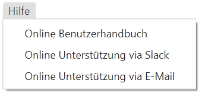

# Menüleiste

Die Menüleiste besteht derzeit aus nachstehenden Registern:

## **ODIN-C2IS**

Habt Ihr die Funktion **„Auf neue Versionen prüfen“** aktiviert, prüft ODIN nach jedem Start, ob auf der Homepage von ODIN (<https://odin.syncpoint.io/>) eine neue Version verfügbar ist.

Ist dies der Fall, erscheint ein Fenster, in welchen Ihr die Möglichkeit habt, Eure ODIN-Version auf die neue Version hin zu aktualisieren oder mit der bisherigen Version weiterzuarbeiten:

Bestätigt Ihr, dass ODIN aktualisiert werden soll, müsst Ihr keine weitere Tätigkeit mehr auszuführen als zu warten, bis ODIN die bisherige Version schließt und mit der aktuellen Version neu startet. Die aktuellen Einstellungen (Projekt, Layer, Kartenausschnitt etc.) bleiben nach dem Neustart erhalten.

## Verwaltung

Mit Auswahl von **„Projekte“** öffnet ihr die Projektverwaltung, in welchen Ihr Projekte anlegen, umbenennen, löschen, exportieren, importieren bzw. zu einem anderen Projekt wechseln könnt (Details siehe Projektverwaltung).

Mit Auswahl von **„Basiskarten“** öffnet ihr die „Kartenverwaltung“, in welchen Ihr Online- und Offlinekarten einbinden und somit diese in ODIN nutzen könnt (Details siehe Kartenverwaltung).

## **Bearbeiten**

Hier sind die typischen Windows Funktionalitäten abgebildet. Diese sind auch über die Activity Bar verfügbar.

## **Anzeige**

Die Funktion **„Entwickler Werkzeuge ein/aus“** ist grundsätzlich für Euch nicht relevant. Sollte es zu Problemen in der Nutzung kommen und Ihr benötigt einen Support, dann kann es sein, dass wir Euch bitten werden, über diese Funktion uns nähere Infos bereitzustellen, damit wir Euch weiterhelfen können.

Mit **„Heranzoomen“** (`STRG` + `SHIFT` + `=`) und **„Herauszoomen“** (`STRG` + `-`) kann der Darstellungsbereich der Karte selbst, aber auch die Anzeigen auf dieser (z.B. Activity Bar, Maßstab, Projekt-/Layername etc.) vergrößert oder verkleinert werden. Mit „Originalgröße“ (`STRG` + `0`) könnt Ihr wieder zur Standardeinstellung von ODIN zurückkehren:

|  |  |  |
| :------------------------------: | :------------------------------: | :------------------------------: |
|          (herangezoomt)          |         (Originalgröße)          |         (herausgezoomt)          |

Mit der Funktion **„MGRS Gitter“** könnt Ihr weltweit ein MGRS (Military Grid Reference System)-Meldegitternetz auf allen Euren in ODIN verwendeten Karten (z.B. auch auf Orthofotokarten) ein- bzw. ausblenden:

|  |  |
| :------------------------------: | :------------------------------: |

Mit der Funktion **„Labels“** könnt Ihr in ODIN  wählen, ob die Modifier bei den Features auf der Karte mit angezeigt werden sollen oder nicht:

|  |  |
| :--------------------------------: | :--------------------------------: |
|       (Labels eingeblendet)        |       (Labels ausgeblendet)        |

## **Fenster**

## **Sprache**

Hier könnt Ihr die Anzeige der Funktionen, Tooltips etc., welche die **Benutzeroberfläche** betreffen zwischen **„Deutsch“** und **„Englisch“** umschalten.

## **Hilfe**

Wenn Ihr Hilfe benötigt, könnt Ihr hier das **Online Benutzerhandbuch von ODIN** aufrufen.

