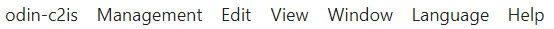
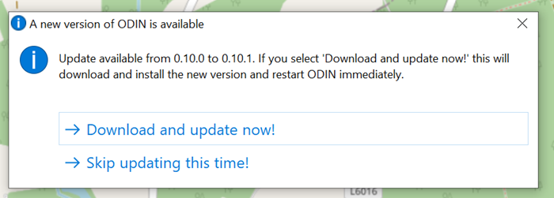
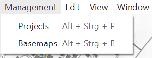
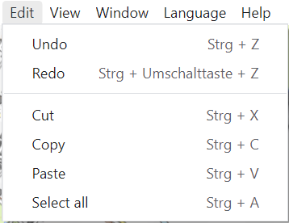
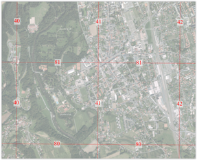
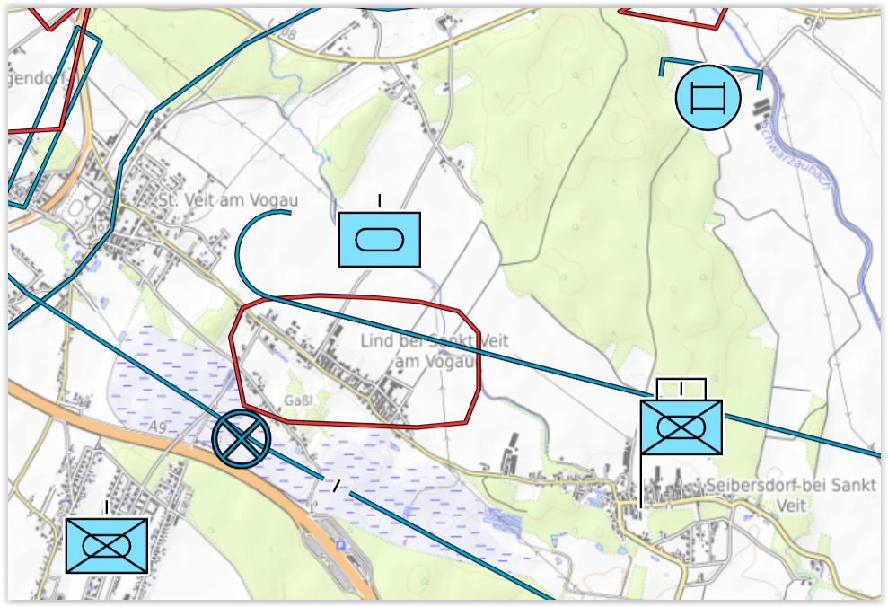
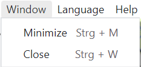
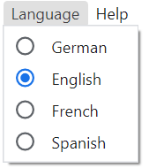
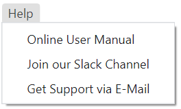

# Menu bar

The menu bar consists of the following entries:

## ODIN-C2IS

If you have activated the function **"Check for new versions "**, ODIN checks after every start, if there is a new version available on the homepage of ODIN (<https://odin.syncpoint.io/>).

If this is the case, a window appears, in which you have the possibility to update your ODIN version to the new version or to continue working with the previous version:

If you confirm that ODIN should be updated, you don't have to do anything else but wait until ODIN closes the previous version and restarts with the current version. The current settings (project, layer, map section etc.) are preserved after the restart.

## Management

With selection of **"Projects "** you open the project administration, in which you can create, rename, delete, export, import projects or switch to another project (details see project administration).

Selecting **"Base maps "** opens the "Map administration", where you can integrate online and offline maps and use them in ODIN (details see Map administration).

## Edit

The typical Windows functionalities are shown here. These are also available from the Activity Bar.

## View

The function **"Developer tools on/off "** is only relevant if there are problems in usage and you need support. Then it may be that we will ask you to provide us with more information given there.

With **"Zoom in "** (`STRG` + `SHIFT` + `=`) and **"Zoom out "** (`STRG` + `-`) the display area of the map itself, but also the displays on it (e.g. activity bar, scale, project/layer name etc.) can be zoomed in or out. With "Original size" (`STRG` + `0`) you can return to ODIN's default setting, e.g. 100%

|  |  |  |
| :------------------------------: | :------------------------------: | :------------------------------: |
|           (zoomed in)            |         (original size)          |           (zoomed out)           |

With the function **"MGRS Grid "** you can show or hide a MGRS (Military Grid Reference System) grid on all your maps used in ODIN (e.g. also on orthophoto maps) worldwide:

|  |  |
| :------------------------------: | :------------------------------: |

With the function **"Labels "** you can choose in ODIN if the modifiers should be shown with the features on the map or not. Note that above a certain scale, labels are never shown.

|  |  |
| :--------------------------------: | :--------------------------------: |
|           (labels shown)           |          (labels hidden)           |

## Window

## Language

Here you can switch the display of the functions, tool tips etc., which concern the **user interface** between **"German "** and **"English "**.

## Help

If you need help, you can access the **online user manual of ODIN** here.
