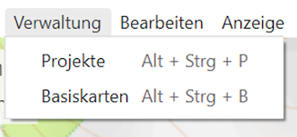
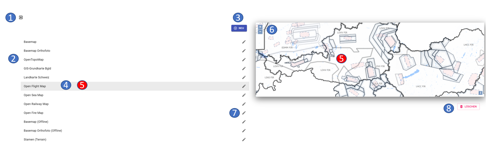
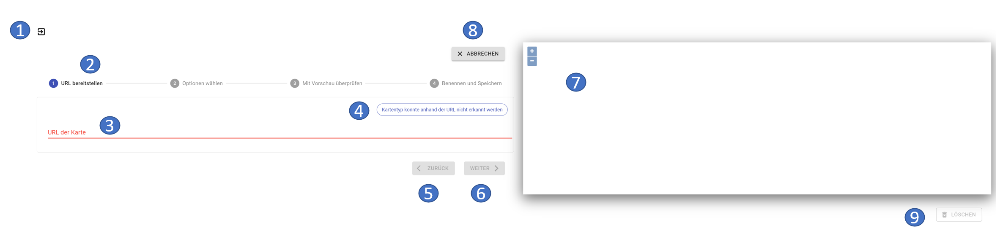
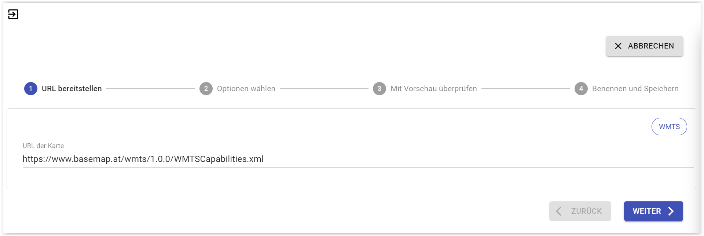
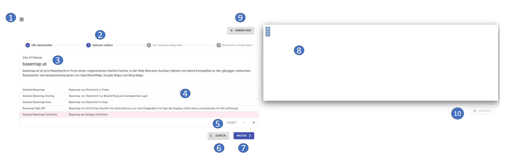
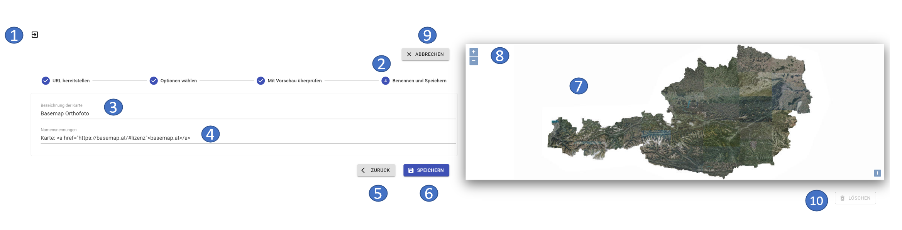

# **Map Management**

In the map administration you can integrate online or offline maps into ODIN or delete them again. The maps created here are then available in ODIN in the area of the "Activity Bar - Base Maps".

The map administration can be called up via the **"Menu bar - Administration tab - Base maps "**:

## **Content Map Management**

The map administration contains the following functionalities:

- 1 exit the map administration (= return to the map)
- 2 listing of all currently integrated online/offline maps
- 3 include new map
- 4 currently marked map
- 5 map preview of the currently marked map
- 6 zoom in/out the map view (incl. moving with the mouse)
- 7 edit/modify an existing map
- 8 delete map

With the button **"New "** you can add a **new map** (online/offline) to ODIN.

In the map preview you can use the two buttons **"+"** / **"-"** (or with the mouse wheel) to zoom the map or move the map with the mouse.

With the **"Pen "**-button you can **change** the **entries** to an already **created map** (e.g. name, map-URL etc.).

The **"Delete "** button **deletes** the currently selected **map** from the map management.

The **Open Street Map** does **not appear in the map management**, since this is the **"system/default" map** of ODIN.

## **Integrate new map into ODIN**

To integrate a new online/offline map into ODIN, the following four steps are necessary (as an example, the integration of the map "basemap.at" is shown here):

### **Step 1 – Provide URL**

- 1 exit the map administration (= return to the map)
- 2 display progress of map integration

- 3 area for entering the URL

- 4 information if entered map URL is correct/processable

- 5 integration step back *(always inactive here)*

- 6 integration step further

- 7 map preview *(always empty here)*

- 8 cancel map integration (= return to map management)

- 9 delete map* *(always inactive here)*

If in the area **"URL of the map "** a **map URL is entered**, the feedback takes place whether the map URL is correct and/or processable and the button **"Next "** is switched active:

### **Step 2 – Select options**

- 1 exit map management (= return to map)
- 2 display progress of map integration
- 3 information about the map (e.g. source, homepage, description etc.)
- 4 display of available maps incl. short description of the content
- 5 display how many maps are shown from the total available maps
- 6 integration step back
- 7 integration step further
- 8 map preview *(here always empty)*
- 9 cancel map integration (= return to map management)
- 10 delete map* *(always inactive here)*

If a **map** is **selected** by marking it with the mouse, it will be highlighted in pink.

With the buttons **"&lt; "** and **"&gt; "** you can switch to the next possible cards further or back again to select them.

Instead of the above mentioned view, it can also be the case in step 2 that here instead of the map selection the **zoom factor** to be displayed for the map can be **defined more precisely**:

By **entering** the maximum supported **zoom level** (for those maps that use an XYZ tile provider but do not support it up to level 42), you can thus avoid a "white map view" in ODIN.

### **Step 3 – Check with preview**

- 1 exit the map management (= return to the map)
- 2 display progress of map integration

- 3 integration step back

- 4 integration step further

- 5 map preview

- 6 zoom in/out the map view (incl. moving with the mouse)

- 7 cancel map integration (= return to map management)

- 8 *delete map* *(always inactive here)*

Here you can check the **content** of the map and its **graphical representation**, as well as the **map information provided therein** in the map preview area by zooming and moving the map:

### **Step 4– Naming and Save**

- 1 exit map management (= return to map)
- 2 display progress of map integration

- 3 set the name of the map

- 4 set naming of the map

- 5 embedding step back

- 6 complete map integration

- 7 map preview

- 8 zoom in/out the map view (including moving it with the mouse)

- 9 cancel map integration (= return to map management)

- 10 *delete map* *(always inactive here)*

In the area **"Name of the map "** you can **assign** a **name** for your **newly included map**. This name will be displayed in the activity bar in the area of the base cards.

In the **"Names "** section you can also specify the **"Source "** of the **map in addition to the map name, so that you don't get any "legal problems" when using it, since most (also free) online/offline maps require at least the "Source" to be specified.

Before integrating maps, you should always check the terms of use to see if a (free) use is possible. Corresponding entries for the online maps we have already checked can be found in Annex A (Overview - Free Online Maps). With Copy & Paste you can easily paste them in the **"Names "** section.

By pressing the button **"Save" you **close** the process of **map integration** and ODIN returns to the map management area. Your newly included map will now appear on the left side in the list of available maps.

