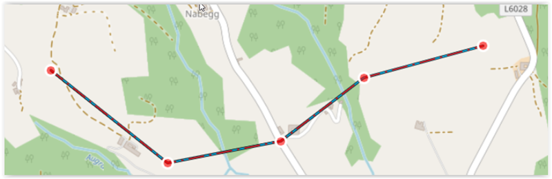
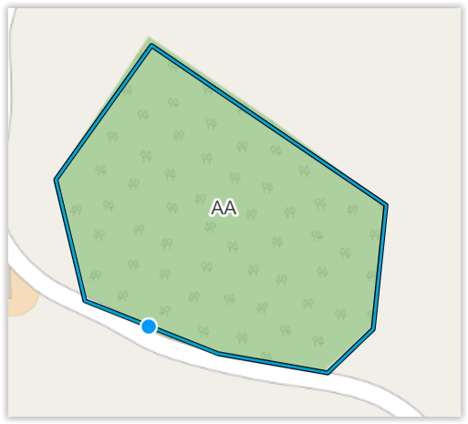
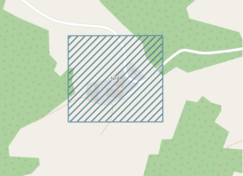
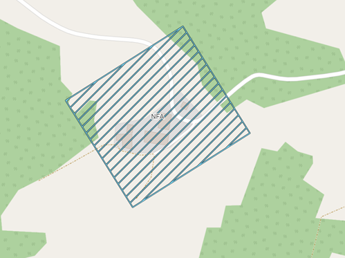

# Bearbeitung von Objekten auf der Karte

In diesem Kapitel wird die Erstellung und Bearbeitung von Objekten mit verschiedenen Geometrien beschrieben.

Die **Darstellung** der Objekte auf der Karte erfolgt grundsätzlich gem. **MIL-STD 2525C**. Einen „Vorgriff“ auf den **MIL-STD 2525D** gibt es bei der Darstellung von **zivilen Fahrzeugen & Geräte (Equipments)** mit der **Farbe „rosa“**, sowie bei den **Aktivitäten (Activities)** mit den **vier schwarzen Quadraten** in jeder Ecke des Grundsymbols.

Mit der Version 0.17.0 wurde begonnen auch die **Mission Task Verbs** aus dem **NATO Standard ATP-112**, sowie **nationale taktische Zeichen** (Effect Verbs, Action Verbs - gekennzeichnet mit "(**AUT only**")) zu implementieren.

Auch wurden in ODIN **Objekte** dann **anderes umgesetzt** zu den Vorgaben gem. MIL-STD 2525C, wenn diese aus **taktischer Sicht notwendig** bzw. **sinnvoller** erschienen (z.B. Direction of Attack als Mehrpunktlinie anstelle einer „2-Punkt-Linie“; zusätzliche Zuordnung von Modifieren (z.B. bei Naturereignissen, Einrichtungen etc.); Auswahl aller Hositlity Statuse bei taktischen Grafiken - Punktobjekte etc.).

## Allgemeines

Die Objekte werden hier nach Ihrer Zuordnung bzw. ihrer Geometrien unterschieden, weil die Erstellung und Bearbeitung, sowie die Inhalte des Eigenschaftsfenster sich nach diesen in ODIN ausrichtet:

- Einheiten (Units)											    	 Punktobjekte
- Waffen, Fahrzeuge, Gerät (Equipments)            Punktobjekte
- Einrichtungen (Installations) 					           Punktobjekte
- Aktivitäten (Activities) 								           Punktobjekte
- SKKM-Symbole (AUT National Civil Symbols)	Punktobjekte
- Taktische Grafiken (tactical Graphics) 	           Punkt, Linien-, Flächen- und Korridorobjekte

Im ersten Teil wird die Erstellung der Objekte auf der Karte aufgrund der Geometrien (Punkt, Linie, Fläche, Korridor) beschrieben.

Im zweiten Teil erfolgt die Beschreibung der Eingabemöglichkeiten (Modifier gem. MIL-STD 2525C, zusätzliche Felder etc.) in den jeweiligen Eigenschaftsfenstern der Objekte.

## Grundsätzlicher Ablauf bei der Erstellung

Der grundsätzliche Ablauf in ODIN um ein Objekt zu erstellen ist
folgender:

-   **aktiven Layer** festlegen bzw. den gewünschten „Ziellayer“ als aktiven Layer festlegen (mit Doppelklick auf den Layernamen);
    
- **Map-Palette** öffnen;
- in der **Suche** den gewünschten Text eingeben (bezieht sich immer auf Symbolnamen und Hierachiepfad);
- gewünschtes **Symbol** im Bereich der Map-Palette mit der Maus anklicken;
- mit der Maus auf die gewünschte(n) **Position(en)** auf der **Karte** klicken;
- **Eigenschaftsfenster** (öffnet sich automatisch) befüllen.

## Erstellung aufgrund Geometrie des Objektes

### Punktobjekte

Nach der **Auswahl** in der **Map-Palette** und dem **Klick** auf die gewünschte **Position** auf der **Karte** ist der Vorgang der Erstellung bereits abgeschlossen und das Eigenschaftsfenster wird geöffnet.

Um die **Position** eines Punktobjektes zu **ändern**, klickt Ihr diese mit der Maus an und verschiebt es auf die neue gewünschte Position.

Bei **Kopieren** (`STRG` + `C`) und **Einfügen** (`STRG` + `V`) erstellt ODIN auf der gleichen Stelle das Objekt nochmals. Wenn Ihr das Objekt anklickt und verschiebt, ist das Objekt nun zweimal auf der Karte ersichtlich. Beim Kopieren werden auch alle dem Objekt bereits im Eigenschaftsfenster zugeordneten Einträge mit kopiert.

Zu beachten ist, dass das kopierte Objekt immer im aktiven Layer abgespeichert wird (auch wenn das „Quell“-Objekt in einem anderen Layer abgespeichert ist).

Um die Darstellung der Lage zu verbessern, könnt Ihr bei den **Punktsymbolen** dazu die **"Offset Location"-Funktion** nützen. Dazu **klickt** Ihr auf das **Objekt**, hält die `ALT-Taste` gedrückt und verschiebt dann mit der **Maus** das **Objekt** auf die **gewünschte Position**:

|  |  |
| :-----------------------------------: | :-----------------------------------: |

Die Linie der "Offset Location" könnt Ihr anpassen, indem Ihr das **Objekt markiert** und danach mit der Maus auf die Linie fährt bis ein **roter Kreis** erscheint. Nun könnt Ihr mit der **Maus** die **Linie verschieben** und einen neuen **Punkt setzen.**

Die zweite Möglichkeit ist, das **Objekt markieren**, die **ALT-Taste gedrückt halten** und mit der **Maus** auf die Position in der **Karte klicken**, wo das Objekt dargestellt werden soll.

Um die "Offset Location" **wieder aufzuheben**, hält Ihr die `ALT-Taste` gedrückt und **klickt** dann auf den **"Startpunkt"** der "Offset Location". 

### Linienobjekte

Nach der **Auswahl** in der **Map-Palette** und dem **Klick** auf die gewünschte **Position** auf der **Karte** beginnt Ihr mit der Eingabe der Linie und fügt mit jedem Mausklick eine neue „Teilstrecke“ hinzu. Mit einem **Doppelklick** auf die Karte **beendet** Ihr die **Eingabe** des Linienobjektes und das Eigenschaftsfenster wird geöffnet.

Um die **Position(en)** einer Linie zu **ändern**, markiert Ihr die Linie und mit wählt einen roten Punkt aus und verschiebt diesen mit der Maus:

Wollt Ihr einen **neuen Punkt setzen**, fährt mit dem Mauszeiger auf die Linie, bis ein **roter Kreis** erscheint und verschiebt diesen mit der Maus:

Zum **Verschieben** der **gesamten Linie** müsst Ihr dabei die `SHIFT-Taste` gedrückt halten.

Um einen **einzelnen Punkt** zu **löschen** müsst Ihr die `ALT-Taste` gedrückt halten und dann den zu löschenden roten Punkt anklicken.

**Kopieren** (`STRG` + `C`) und **Einfügen** (`STRG` + `V`) verhält sich analog zu den Punktobjekten.

### Flächenobjekte

Nach der **Auswahl** in der **Map-Palette** und dem **Klick** auf die gewünschte **Position** auf der **Karte** beginnt Ihr mit der Eingabe der Fläche und fügt mit jedem Mausklick eine neue „Teilstrecke“ hinzu. Beim Zeichnen der Fläche wird dieser Bereich mittels einer transparenten weißen Darstellung hervorgehoben. Mit einem **Doppelklick** auf die Karte **beendet** Ihr die **Eingabe** des Flächenobjektes und das Eigenschaftsfenster wird geöffnet:

Um die **Position(en)** einer Fläche zu **ändern**, markiert Ihr die Fläche und wählt einen der „Eck“-Punkte aus und verschiebt diesen mit der Maus.

Wollt Ihr einen **neuen Punkt setzen**, fährt mit dem Mauszeiger auf die Linie, bis ein **roter Kreis** erscheint und verschiebt diesen mit der Maus:

Zum **Verschieben** der **gesamten Fläche** müsst Ihr dabei die `SHIFT-Taste` gedrückt halten.

Um einen **einzelnen Punkt** zu **löschen** müsst Ihr die `ALT-Taste` gedrückt halten und dann den zu löschenden „Eck“-Punkt anklicken.

**Kopieren** (`STRG` + `C`) und **Einfügen** (`STRG` + `V`) verhält sich analog zu den Punktobjekten.

### Flächenobjekte, rechteckig

Eine Sonderform bei der Bearbeitung stellt das rechteckige Flächenobjekt dar (z.B. für die Darstellung der Feuerstellungsräume wie ACA, NFA, ZOR etc.).

Nach der **Auswahl** in der **Map-Palette** und dem **Klick** auf die gewünschte **Position** auf der **Karte** erscheint das rechteckige Flächenobjekt. Der ausgewählte Punkt mit der Maus auf der Karte ist immer der **linke obere Eckpunkt** des Rechteckes.

Um die **Größe** des Rechteckes zu **ändern**, markiert Ihr das Rechteck, fährt mit dem Mauszeiger auf einen der Eckpunkte bis ein **roter Kreis** erscheint und verschiebt diesen mit der Maus.

Wenn Ihr die Maus auf einen der **Eckpunkte** bewegt bis der **rote Kreis** erscheint, die `STRG`-Taste gedrückt haltet und die Maus danach bewegt, könnt Ihr das **Rechteck rotieren**.

|  |  |
| :-----------------------------------: | :-----------------------------------: |

### Korridorobjekte

Nach der **Auswahl** in der **Map-Palette** und dem **Klick** auf die gewünschte **Position** auf der **Karte** beginnt Ihr mit der Eingabe des Korridors und fügt mit jedem Mausklick eine neue „Teilstrecke“ hinzu. Mit einem **Doppelklick** auf die Karte **beendet** Ihr die **Eingabe** des Korridorobjektes und das Eigenschaftsfenster wird geöffnet.

Um die **Position(en)** eines Korridores zu **ändern**, markiert Ihr den Korridor, wählt einen roten Punkt aus und verschiebt diesen mit der Maus:

Wollt Ihr einen **neuen Punkt setzen**, fährt mit dem Mauszeiger auf die rote innere Linie, bis ein **roter Kreis** erscheint und verschiebt diesen mit der Maus.

Die **Breite** des Korridors könnt Ihr **ändern**, indem Ihr am Ende des Korridors den seitlichen roten Punkt mit der Maus verschiebt.

Wenn beim Erstellen oder Ändern des Korridors eine Geometrie entsteht, die nicht mehr auf der Karte übersichtlich dargestellt werden kann, erscheint der Korridor mit einer gelb-schwarzen Linie und dem Hinweis, dass eine ungültige Geometrie gewählt wurde:

Dies könnt Ihr beheben, in dem Ihr die Breite des Korridors kleiner macht oder die roten Punkte entsprechend verändert.

Zum **Verschieben** des **gesamten Korridors** müsst Ihr dabei die `SHIFT-Taste` gedrückt halten.

Um einen **einzelnen Punkt** zu **löschen** müsst Ihr die `ALT-Taste` gedrückt halten und dann den zu löschenden roten Punkt anklicken.

**Kopieren** (`STRG` + `C`) und **Einfügen** (`STRG` + `V`) verhält sich analog zu den Punktobjekten.

