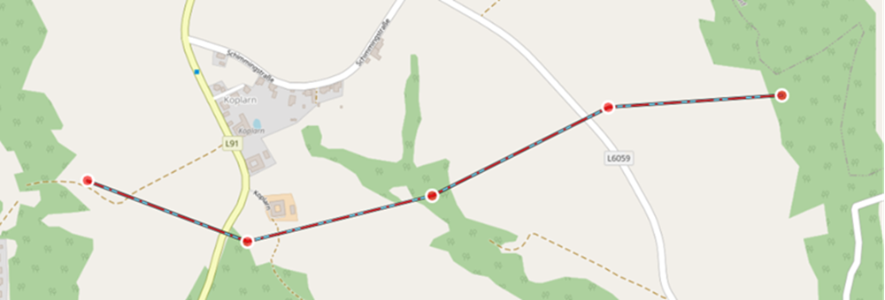
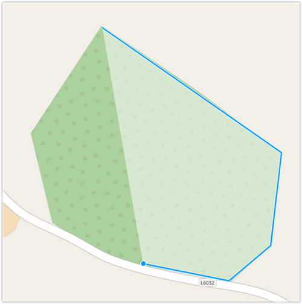
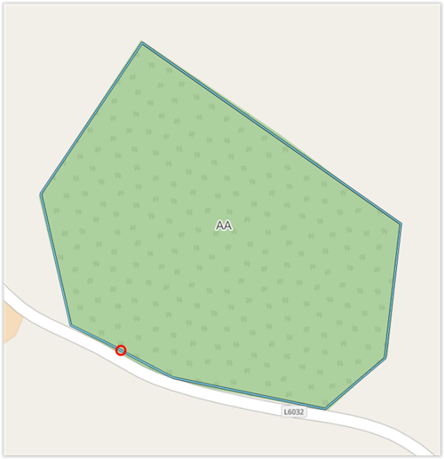

# Editing objects on the map

This chapter describes the creation and editing of objects with different geometries.

The **representation** of the objects on the map is basically done according to **MIL-STD 2525C**. An "anticipation" of the **MIL-STD 2525D** can be found in the representation of **civilian vehicles & equipment** with the **color "pink"**, as well as in the **activities** with the **four black squares** in each corner of the basic symbol.

In ODIN some deviations tending towards MIL-STD 2525D are chosen where MIL-STD 2525C does not reflect **tactical necessity** and/or **sensible reason** (e.g. Direction of Attack as multi-point line instead of a "2-point line"; additional assignment of modifiers (e.g. with natural events, facilities etc.); selection of all Hostility Status with tactical graphics - point objects etc.)

## General

The objects are distinguished according to their assignment or their geometries, because the creation and editing, as well as the contents of the properties window are aligned according to these in ODIN:

- units point objects
- weapons, vehicles, equipment (Equipments) point objects
- installations point objects
- activities point objects
- tactical Graphics point, line, area and corridor objects

The first part describes the creation of objects on the map based on geometries (point, line, area, corridor).

The second part describes the input options (modifiers according to MIL-STD 2525C, additional fields, etc.) in the respective property windows of the objects.

## Basic procedure for creation

-   The basic procedure in ODIN to create an object is the following:

    - **Set active layer** or set the desired "target layer" as the active layer (double click on the layer name);

    - open the **map palette**;
    - enter search text (always refers to symbol name and hierarchy path);
    - click with the mouse on the desired **symbol** in the area of the map palette;
    - click with the mouse on the desired **position(s)** on the **map**;
    - fill **property window** (opens automatically).

## Creation based on geometry of the object

### Point objects

After the **selection** in the **map palette** and the **click** on the **position** on the **map**, the creation process is already completed and the properties window opens.

To **change** the **position** of a point object, you click on it with the mouse and move it to the new position.

With **Copy** (`STRG` + `C`) and **Paste** (`STRG` + `V`) ODIN creates the object again on the same position. When you click and move the object, the object is now visible twice on the map. When copying, all entries already assigned to the object in the properties window will also be copied.

Note that the copied object is always saved in the active layer (even if the "source" object is saved in another layer).

To improve the display of the location, you can use the **"Offset Location" function** for the **point symbols**. To do this, **click** on the **object**, hold down the `ALT` key and then use the **mouse** to move the **object** to the **desired position**:

|  |  |
| :-----------------------------------: | :-----------------------------------: |

You can adjust the line of the "Offset Location" by selecting the **object** and then moving the mouse over the line until a **blue dot** appears. Now you can move the line with the **mouse** and set a new **point**.

To cancel the "Offset Location" **again**, hold down the `ALT` key and **click** on the **"Start Point"** of the "Offset Location".

### Line objects

After the **selection** in the **Map Palette** and the **click** on the desired **position** on the **map** you start to enter the line and add a new "section" with each mouse click. With a **double click** on the map you **finish** the **entry** of the line object and the properties window opens.

To **change** the **position(s)** of a line, select the line and with select a red point and move it with the mouse:

If you want to set a **new point**, move the mouse pointer onto the line until a blue point and the **"hand"-symbol** appears and move it with the mouse:

To **move** the **entire line** you have to hold down the `SHIFT` key.

To **delete** a single point you have to hold down the `ALT` key and then click on the red point you want to delete.

**Copy** (`CTRL` + `C`) and **Paste** (`CTRL` + `V`) behave analogously to the point objects.

### Surface objects

After **selecting** in the **Map palette** and **clicking** on the desired **position** on the **map**, you start entering the area and add a new "section" with each mouse click. When drawing the area, this area is highlighted by means of a transparent white representation. With a **double click** on the map you **finish** the **entry** of the surface object and the properties window is opened:

To change the **position(s)** of a surface, select the surface and choose one of the "corner" points and move it with the mouse.

If you want to set a **new point**, move the mouse pointer onto the line until a blue point and the **"hand"-symbol** appears and move it with the mouse:

To **move** the **entire area** you have to hold down the `SHIFT` key.

To **delete** a **single point** you have to hold down the `ALT` key and then click on the "corner" point you want to delete.

**Copy** (`STRG` + `C`) and **Paste** (`STRG` + `V`) behave analogously to the point objects.

### Corridor objects

After **selecting** in the **Map palette** and **clicking** on the desired **position** on the **map**, you start entering the corridor and add a new "section" with each mouse click. With a **double click** on the map you **finish** the **entry** of the corridor object and the properties window opens.

To **change** the **position(s)** of a corridor, select the corridor, choose a red point and move it with the mouse:

If you want to set a **new point**, move the mouse pointer to the red inner line until a blue point and the **"hand" symbol** appear and move it with the mouse.

You can **change** the **width** of the corridor by moving the red dot on the side at the end of the corridor with the mouse.

In rare cases, the corridor's geometry might lead to invalid or degenerated visualization.
In this case the corridor will appear with a yellow-black line and a note indicating that an invalid geometry has been created:

You can fix this by making the width of the corridor smaller or by changing the red dots accordingly. Tip: For most corridor types, the last/arrow segment must have a certain length to be correctly displayed.

To **move** the **entire corridor** you have to hold down the `SHIFT` key.

To **delete** a **single point** you have to hold down the `ALT` key and then click on the red point you want to delete.

**Copy** (`CTRL` + `C`) and **Paste** (`CTRL` + `V`) behave analogously to the point objects.

