# Eigenschaftsfenster der Objekte

Der Inhalt der Eigenschaftsfenster **orientiert** sich an den **Vorgaben des MIL-STD 2525C** (= Zuordnung der entsprechenden Modifier). Es sind jedoch **noch nicht alle Modifier** dzt. in ODIN **verfügbar** (z.B. Evaluation Rating etc.).

Für jene **Symbole** (z.B. Naturereignisse, Action Points etc.), denen gemäß MIL-STD 2525C **keine Modifier dezidiert zugeordnet** sind, haben wir ein **„Basis-Set“** an Eigenschaften hinzugefügt, damit Ihr zumindest die **grundlegendsten Informationen** dazu eingeben könnt.

Auch haben wir **Modifier**, die zwar gem. MIL-STD 2525C nicht zugeordnet sind, aber aus taktischer Sicht Sinn machen, **zusätzlich** in der Darstellung mit **aufgenommen** (z.B. bei Einrichtungen denn Modifier „Special C2 HQ“, damit Dienststellen wie z.B. TÜA, BMLV, MilKdoK etc.).

Sobald Ihr im Eigenschaftsfenster eine Eingabe bestätigt oder ein anderes Feld auswählt, erfolgt die **Anzeige** der Eingabe **unmittelbar** auf der **Karte** (sofern der Modifier gem. MIL-STD 2525C auf der Karte darzustellen ist).

 

## Eingabefelder die für verschiedene Objektbereiche gleich sind

Die nachstehenden Felder sind in den verschiedensten Eigenschaftsfenstern enthalten, bieten verschiedene Auswahlmöglichkeiten und werden daher hier gesondert beschrieben:

Das Feld **„Name“** bzw. wenn dieses Feld leer ist, dann das Feld **„Unique Designation“** werden im „Layerbaum“ (beim Layermanagement) angezeigt. Sind beide Felder leer erfolgt die Anzeige im „Layerbaum“ mit **„N/A“** (not available):

| 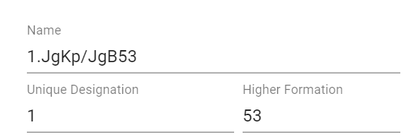 |  |
| :------------------------------------: | :------------------------------------: |
|  |  |
|  |  |

Beim Feld **„Hostility Status“** könnt Ihr folgende Angaben für das Objekt in einem Drop-Down-Menü auswählen:

Bei taktischen Grafiken wird „ENY“ auf der Karte mit angezeigt, wenn der Hostility Status **„Hostile“** ausgewählt wurde und der Modifier „N“ (Enemy) gemäß MIL-STD 2525C beim jeweiligen Objekt vorgesehen ist.

Wird der Hostility Status **„N/A“** bei Einheiten, Waffen – Fahrzeug – Gerät, Einrichtungen und Aktivitäten ausgewählt, verschwindet das Objekt dzt. von der Karte. Die taktischen Grafiken können mit dem Hostility Status **„N/A“** nun in schwarzer Farbe auf der Karte dargestellt werden (z.B. in Plänen etc.):

Mit **„Present“** und **„Anticipated/Planned“** könnt Ihr festlegen, ob das Objekt durchgezogen oder strichliert auf der Karte dargestellt werden soll:

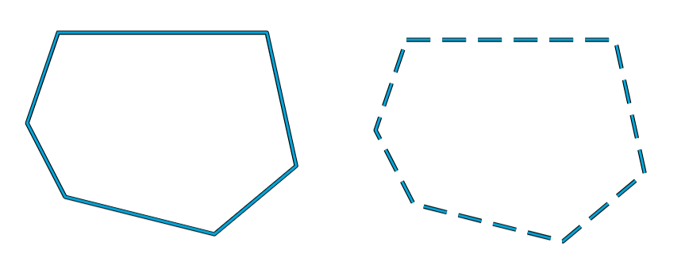

Beim Feld **„Echelon“** könnt Ihr folgende Größenangaben für das Objekt in einem Drop-Down-Menü auswählen:

Beim Feld **„Operational Conditions“** könnt Ihr folgende Angaben für das Objekt in einem Drop-Down-Menü auswählen:

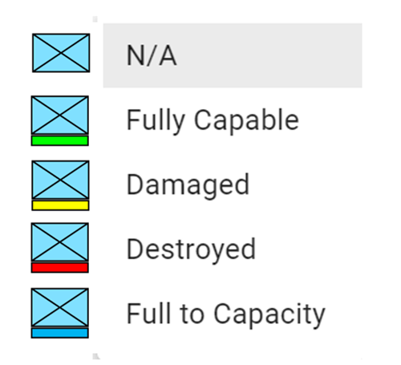

## Einheiten (Units)

Bei den Einheiten können derzeit folgende Eigenschaften eingegeben werden:

|  |  |
| -------------------------------------- | -------------------------------------- |

- 1 markiertes Objekt auf der Karte

- 2 aktueller Bereich Eigenschaften

- 3 Wechseln zum Bereich für Links/WebLinks

- 4 Name des Objektes

- 5 eigene Bezeichnung

- 6 vorgesetzte Dienststelle(n)

- 7 Special C2 HQ

- 8 Größensymbol

- 9 Hostility Status

- 10 Datum- und Zeitangabe

- 11 Geschwindigkeit

- 12 Richtung

- 13 Staff Comment

- 14 zusätzliche Informationen

- 15 gemeldet/geplant

- 16 Operational Conditions

- 17 Modifier für Kommando, Kampfgruppe und Täuschung

- 18 Modifier für Angabe von verstärkt/vermindert/gemischt

Mit dem Feld **„Special C2 HQ“** könnt Ihr Einheiten darstellen, deren Bezeichnung im Artsymbol abgebildet wird:

Die Felder **„Date-Time-Group“**, **„Speed“**, **„Direction“**, **„Staff Comments“** und **„Additional Information“** sind Freitextfelder.

Mit den Modifier **„HQ“** (Gefechtsstand), **„Task Force“ ** (Kampfgruppe) und **„Feint/Dummy“** (für Schein/Täuschung) verändert sich die Darstellung der Einheit wie folgt:

Mit den Modifier **„None“** (normale Stärke), **„(+)“** (verstärkt), **„(-)“** (vermindert) und **„(±)“** (gemischt) verändert sich die Darstellung der Einheit wie folgt:

Die Detailinformationen zum zweiten Bereich des Eigenschaftsfensters findet Ihr im Bereich Links/WebLinks.

## Waffen, Fahrzeuge und Gerät (Equipments)

Bei den Waffen, Fahrzeugen und Geräten können derzeit folgende Eigenschaften eingegeben werden:

|  |  |
| ---------------------------------------- | ---------------------------------------- |

- 1 markiertes Objekt auf der Karte

- 2 aktueller Bereich Eigenschaften

- 3 Wechseln zum Bereich für Links/WebLinks

- 4 Name des Objektes

- 5 eigene Bezeichnung

- 6 Anzahl

- 7 Type

- 8 Mobilität

- 9 Hostility Status

- 10 Datum- und Zeitangabe

- 11 Geschwindigkeit

- 12 Richtung

- 13 Staff Comment

- 14 zusätzliche Informationen

- 15 gemeldet/geplant

- 16 Operational Conditions

Beim Feld **„Mobility“** könnt Ihr folgende Angaben für das Objekt in einem Drop-Down-Menü auswählen:

Die Felder **„Quantity“**, **„Type“**, **„Date-Time-Group“**, **„Speed“**, **„Direction“**, **„Staff Comments“** und **„Additional Information“** sind Freitextfelder.

Die Detailinformationen zum zweiten Bereich des Eigenschaftsfensters findet Ihr im Bereich Links/WebLinks.

## Einrichtungen (Installation)

Bei den Einrichtungen können derzeit folgende Eigenschaften eingegeben werden:

|  | 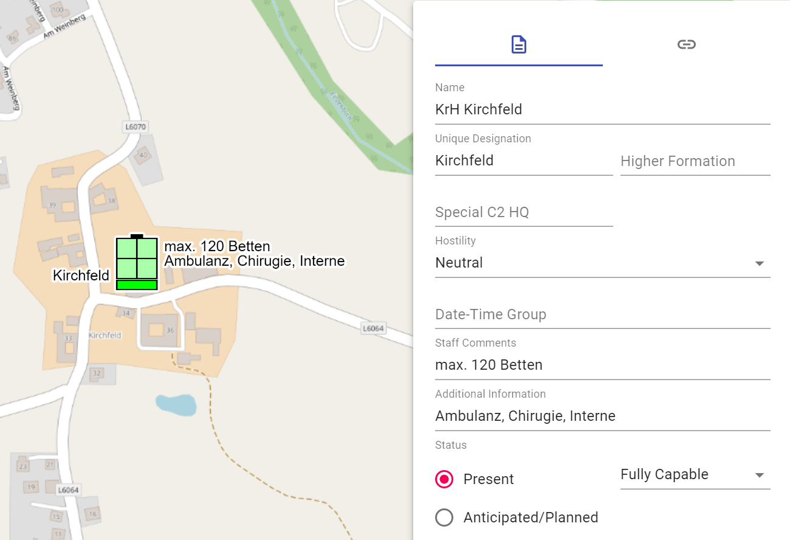 |
| ------------------------------------------ | ------------------------------------------ |

- 1 markiertes Objekt auf der Karte

- 2 aktueller Bereich Eigenschaften

- 3 Wechseln zum Bereich für Links/WebLinks

- 4 Name des Objektes

- 5 eigene Bezeichnung

- 6 vorgesetzte Dienststelle(n)

- 7 Special C2 HQ

- 8 Hostility Status

- 9 Datum- und Zeitangabe

- 10 Staff Comment

- 11 zusätzliche Informationen

- 12 gemeldet/geplant

- 13 Operational Conditions

Mit dem Feld **„Special C2 HQ“** könnt Ihr Einrichtungen darstellen, deren Bezeichnung im Artsymbol abgebildet wird:

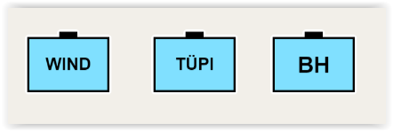

Die Felder **„Date-Time-Group“**, **„Staff Comments“** und **„Additional Information“** sind Freitextfelder.

Die Detailinformationen zum zweiten Bereich des Eigenschaftsfensters findet Ihr im Bereich Links/WebLinks.

## Aktivitäten (Activities)

Bei den Aktivitäten können derzeit folgende Eigenschaften eingegeben werden:

|  |  |
| ----------------------------------------- | ----------------------------------------- |

- 1 markiertes Objekt auf der Karte

- 2 aktueller Bereich Eigenschaften

- 3 Wechseln zum Bereich für Links/WebLinks

- 4 Name des Objektes

- 5 eigene Bezeichnung

- 6 Hostility Status

- 7 Datum- und Zeitangabe

- 8 Geschwindigkeit

- 9 Richtung

- 10 Staff Comment

- 11 zusätzliche Informationen

- 12 gemeldet/geplant

- 13 Operational Conditions

Die Felder **„Date-Time-Group“**, **„Speed“**, **„Direction“**, **„Staff Comments“** und **„Additional Information“** sind Freitextfelder.

Die Detailinformationen zum zweiten Bereich des Eigenschaftsfensters findet Ihr im Bereich Links/WebLinks.

## Zivile SKKM-Symbole

Um eine **gemeinsame Lagedarstellung** zwischen **militärischen und zivilen Kräften in Österreich** bei Anlassfällen (z.B. Katastrophenfällen, Unglücke im größeren Ausmaß, gemeinsame Übungen etc.) zu ermöglichen, haben wir die grundlegenden nationalen SKKM-Symbole ab der Version 0.18.0 implementiert.

Die SKKM-Symbole können in der Map-Palette am Besten mit dem Suchbegriff **"SKKM"** gefunden werden. Weiters sind diese mit dem Zusatz **"(AUT ONLY)"** gekennzeichnet. Dies dient der Informationen unserer internationalen Benutzer, dass es sich hierbei um rein nationale österreichische Symbole handelt.

Bei diesen Objekten können derzeit folgende Eigenschaften eingegeben werden:

| 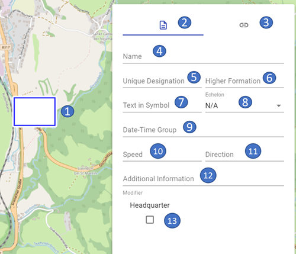 | 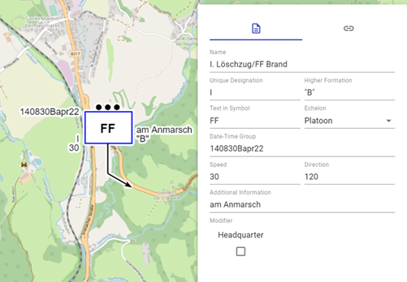 |
| ----------------------------------------- | ----------------------------------------- |

- 1 markiertes Objekt auf der Karte

- 2 aktueller Bereich Eigenschaften

- 3 Wechseln zum Bereich für Links/WebLinks

- 4 Name des Objektes

- 5 eigene Bezeichnung

- 6 vorgesetzte Dienststelle(n)                                   (dzt. nur bei Formationen und Person in Kommandantenfunktion verfügbar)

- 7 Text im Symbol                                                       (dzt. nur bei Formationen verfügbar)

- 8 Größensymbol                                                        (dzt. nur bei Formationen und Person in Kommandantenfunktion verfügbar)

- 9 Datum- und Zeitangabe

- 10 Geschwindigkeit

- 11 Richtung

- 11 zusätzliche Informationen

- 12 Befehls-/Führungsstelle                                      (dzt. nur bei Formationen verfügbar)

Die Felder **„Date-Time-Group“**, **„Speed“**, **„Direction“** und **„Additional Information“** sind Freitextfelder.

Mit dem Feld **"Headquarter"** kann bei Formationen angegeben werden, ob es sich hierbei um eine Befehls- bzw. Führungsstelle handelt.

Die Detailinformationen zum zweiten Bereich des Eigenschaftsfensters findet Ihr im Bereich Links/WebLinks.

Nachstehend eine Übersicht über die dzt. implementierten SKKM-Symbole:

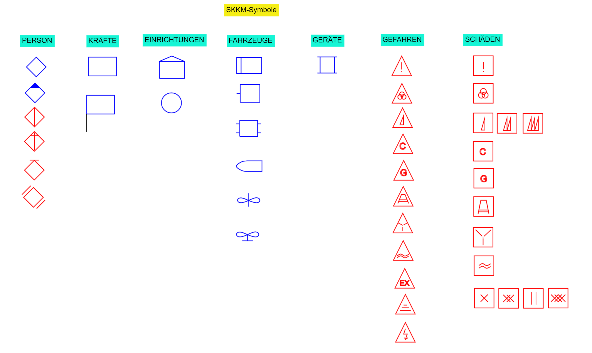

## Symbole ohne Modifier gem. MIL-STD 2525C

Im MIL-STD 2525C sind Symbole angeführt, welchen keine Modifier bei den Beispielen dediziert zugeordnet sind. Daher haben wir diesen Symbolen hier ein „Basis-Set“ an Eigenschaften zugeordnet, um die erstellten Objekte dahingehend befüllen zu können.

Bei diesen Objekten können derzeit folgende Eigenschaften eingegeben werden:

|  | 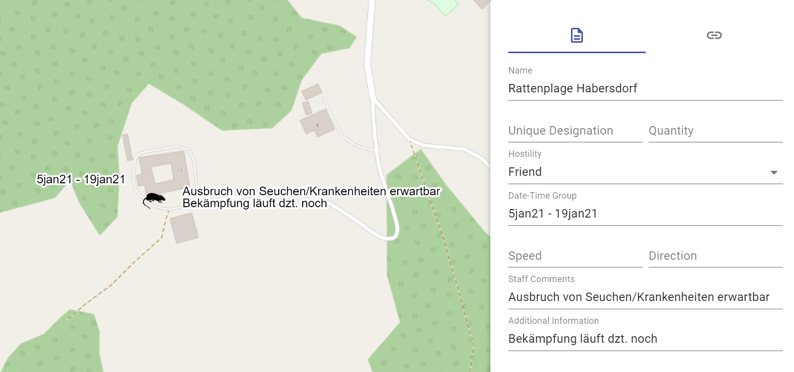 |
| -------------------------------------------------- | -------------------------------------------------- |

- 1 markiertes Objekt auf der Karte

- 2 aktueller Bereich Eigenschaften

- 3 Wechseln zum Bereich für Links/WebLinks

- 4 Name des Objektes

- 5 eigene Bezeichnung

- 6 Anzahl

- 7 Hostility Status

- 8 Datum- und Zeitangabe

- 9 Geschwindigkeit

- 10 Richtung

- 11 Staff Comment

- 12 zusätzliche Informationen

Die Felder **„Quantity“**, **„Date-Time-Group“**, **„Speed“**, **„Direction“**, **„Staff Comments“** und **„Additional Information“** sind Freitextfelder.

Die Detailinformationen zum zweiten Bereich des Eigenschaftsfensters findet Ihr im Bereich Links/WebLinks.

## Taktische Grafiken - Punktobjekte

Bei den taktischen Grafiken - Punktobjekte können derzeit folgende Eigenschaften eingegeben werden:

|  |  |
| -------------------------------------------------- | -------------------------------------------------- |

- 1 markiertes Objekt auf der Karte

- 2 aktueller Bereich Eigenschaften

- 3 Wechseln zum Bereich für Links/WebLinks

- 4 Name des Objektes

- 5 eigene Bezeichnung

- 6 Hostility Status

- 7 Datum- und Zeitangabe

- 8 Staff Comment

- 9 zusätzliche Informationen

- 10 Höhe bzw. Tiefe

Die Felder **„Date-Time-Group“**, **„Staff Comments“**, **„Additional Information“** und **„Höhe/Tiefe“** sind Freitextfelder.

Die Detailinformationen zum zweiten Bereich des Eigenschaftsfensters findet Ihr im Bereich Links/WebLinks.

## Taktische Grafiken - Linienobjekte

Bei den taktischen Grafiken - Linienobjekte können derzeit folgende Eigenschaften eingegeben werden:

|  |  |
| --------------------------------------------------- | --------------------------------------------------- |

- 1 markiertes Objekt auf der Karte

- 2 aktueller Bereich Eigenschaften

- 3 Wechseln zum Bereich für Links/WebLinks

- 4 Name des Objektes

- 5 eigene Bezeichnung

- 6 zusätzliche Informationen

- 7 Hostility Status

- 8 Größensymbol

- 9 gemeldet/geplant

- 10 Datum- und Zeitangabe (von – bis)

- 11 Höhe (von – bis)

Die Felder **„Additional Information“**, **„Effective (from)“**, **„Effective (to)“**, **„Altitude (from)“** und **„Altitude (to)“** sind Freitextfelder.

Bei **Linienobjekten**, die dzt. in ODIN **nicht** auf der **Karte dargestellt** werden können, ist der **Hierarchiepfad in roter Schrift** und mit dem Wort **„(unsupported)“** gekennzeichnet.

Die Detailinformationen zum zweiten Bereich des Eigenschaftsfensters findet Ihr im Bereich Links/WebLinks.

## Taktische Grafiken – Linienobjekte (Grenzen)

Eine Sonderform bei den Linienobjekten stellen die Grenzen dar. Hier können folgende Eigenschaften eingegeben werden:

|  | 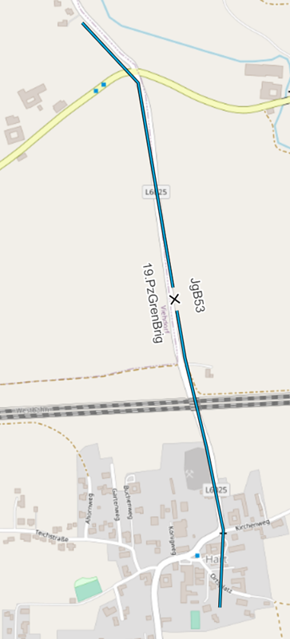 |
| ----------------------------------------------- | ----------------------------------------------- |

- 1 markiertes Objekt auf der Karte

- 2 aktueller Bereich Eigenschaften

- 3 Wechseln zum Bereich für Links/WebLinks

- 4 Name des Objektes

- 5 eigene Bezeichnung (linke/rechte Grenze)

- 6 zusätzliche Informationen

- 7 Hostility Status

- 8 Größensymbol

- 9 Anordnung des Größensymbols

- 10 gemeldet/geplant

- 11 Datum- und Zeitangabe (von – bis)

- 12 Höhe (von – bis)

In den Feldern **„Unique Designation (Left)“** und **„Unique Designation (Right)“** könnt Ihr auf Höhe des Größensymbols den **linken** und **rechten Nachbarn** eingeben.

Im Feld **„Label Placement“** könnt Ihr die Darstellung des **Größensymbols**, sowie des linken und rechten Nachbarn auf der Linie **verschieben**, um bei Bedarf eine bessere Lesbarkeit auf der Karte zu ermöglichen:

| 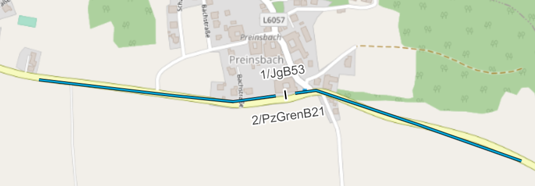 |   |
| :----------------------------------------: | :-----------------------------------------: |
|  | 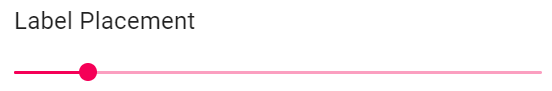 |

Die Felder **„Additional Information“**, **„Effective (from)“**, **„Effective (to)“**, **„Altitude (from)“** und **„Altitude (to)“** sind Freitextfelder.

Die Detailinformationen zum zweiten Bereich des Eigenschaftsfensters findet Ihr im Bereich Links/WebLinks.

## Taktische Grafiken - Flächenobjekte

Bei den taktischen Grafiken - Flächenobjekte können derzeit folgende
Eigenschaften eingegeben werden:

| 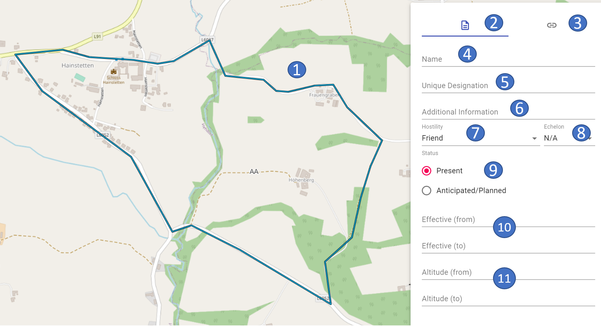 |  |
| ----------------------------------------------------- | ----------------------------------------------------- |

- 1 markiertes Objekt auf der Karte

- 2 aktueller Bereich Eigenschaften

- 3 Wechseln zum Bereich für Links/WebLinks

- 4 Name des Objektes

- 5 eigene Bezeichnung

- 6 zusätzliche Informationen

- 7 Hostility Status

- 8 Größensymbol

- 9 gemeldet/geplant

- 10 Datum- und Zeitangabe (von – bis)

- 11 Höhe (von – bis)

Bei den Flächenobjekten wird die **Art des Raumes** und die **Unique Designation** (Modifier „T“) in der Mitte der Fläche bei jenen Objekten angezeigt, denen es in den Beispielen des MIL-STD 2525C dezidiert angeordnet ist.

Bei jenen Flächenobjekten (z.B. Lufträume), denen gemäß MIL-STD 2525C die Eigenschaften **Effective (from)** (Modifier „W“), **Effective (to)** (Modifier „W1“), **Altitude (from)** (Modifier „X“) und **Altitude (to)** (Modifier „X1“) in den Beispielen dediziert zugeordnet wurden, werden diese in der **Mitte des Raumes** auf der Karte dargestellt:

Bei **Flächenobjekte**, die dzt. in ODIN **nicht** auf der **Karte dargestellt** werden können, ist der **Hierarchiepfad in roter Schrift** und mit dem Wort **„(unsupported)“** gekennzeichnet.

Die Detailinformationen zum zweiten Bereich des Eigenschaftsfensters findet Ihr im Bereich Links/WebLinks.

## Bereich Links/WebLinks

Im Bereich der **Links/WebLinks** könnt Ihr zu einem Objekt auf der Karte **Links zu Dateien** auf Euren **Rechner** bzw. zu **WebLinks ins Internet** hinzufügen:

|  |  |
| ---------------------------------- | ---------------------------------- |

- 1 markiertes Objekt auf der Karte

- 2 Wechseln zum Bereich Eigenschaften

- 3 aktueller Bereich für Links/WebLinks

- 4 Drag & Drop-Feld zum „Verlinken“ der Dateien/URL‘s

- 5 Anzeige der Anzahl der „verlinkten“ Dateien/URL’s

- 6 Anzeige der „verlinkten“ Dateien/URL’s (zum Öffnen)

- 7 Button zum Löschen der „Verlinkung“

Damit könnt Ihr z.B. für eine Einheit auf der Karte den taktischen Befehl, die Truppeneinteilung, Infos zu Waffen & Gerät etc. hinzufügen und somit auf entsprechenden Informationen schnell und direkt zugreifen.

Die jeweiligen Dateien werden in externen Programmen (z.B. Word, PowerPoint etc.) gesondert geöffnet.

„Verlinkte“ Objekte werden im Layermanagement wie folgt angezeigt:

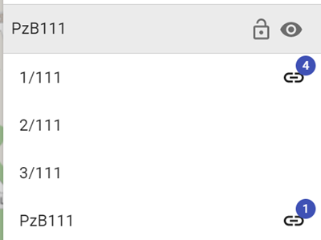

Es gibt keine Beschränkung von der Anzahl der „Verlinkungen“ her. Im Layermanagement wird bei mehr als 100 Links jedoch nur mehr die Zahl „99“ angezeigt.

Beim Öffnen einer „Verlinkung“ erscheint aus Sicherheitsgründen folgendes Fenster:

Hiermit könnt Ihr festlegen, ob ein Link bzw. URL geöffnet werden soll (= **Erlauben**) oder nicht (= **Ablehnen**). Wenn Ihr die Abfrage nicht beim Ausführen von jeder „Verlinkung“ bestätigen wollt, könnt Ihr durch Auswahl der Funktion **„Bis zum nächsten Neustart von ODIN immer erlauben“** die von Euch gewählte Einstellung festlegen.

Nach dem Neustart von ODIN erfolgt wieder eine neuerliche Abfrage beim erstmaligen Öffnen einer Verlinkung.

Beim **Export** eines **Projektes** oder eines **Layers** werden die Links/Weblinks mit exportiert. Zu beachten ist jedoch, dass beim Import des Projektes/Layers nur **jene Dateien bzw. URL’s** geöffnet werden können, auf die **der andere Benützer auch Zugriff hat** (z.B. gemeinsame Ordner auf dem Server etc.).

Ist eine „Verlinkung“ nicht mehr gültig, erhaltet Ihr folgende Rückmeldung von ODIN:

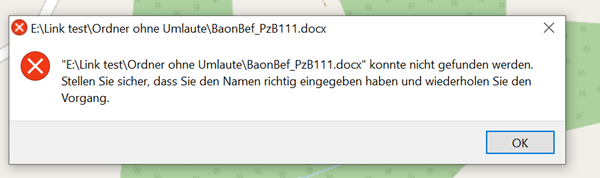

