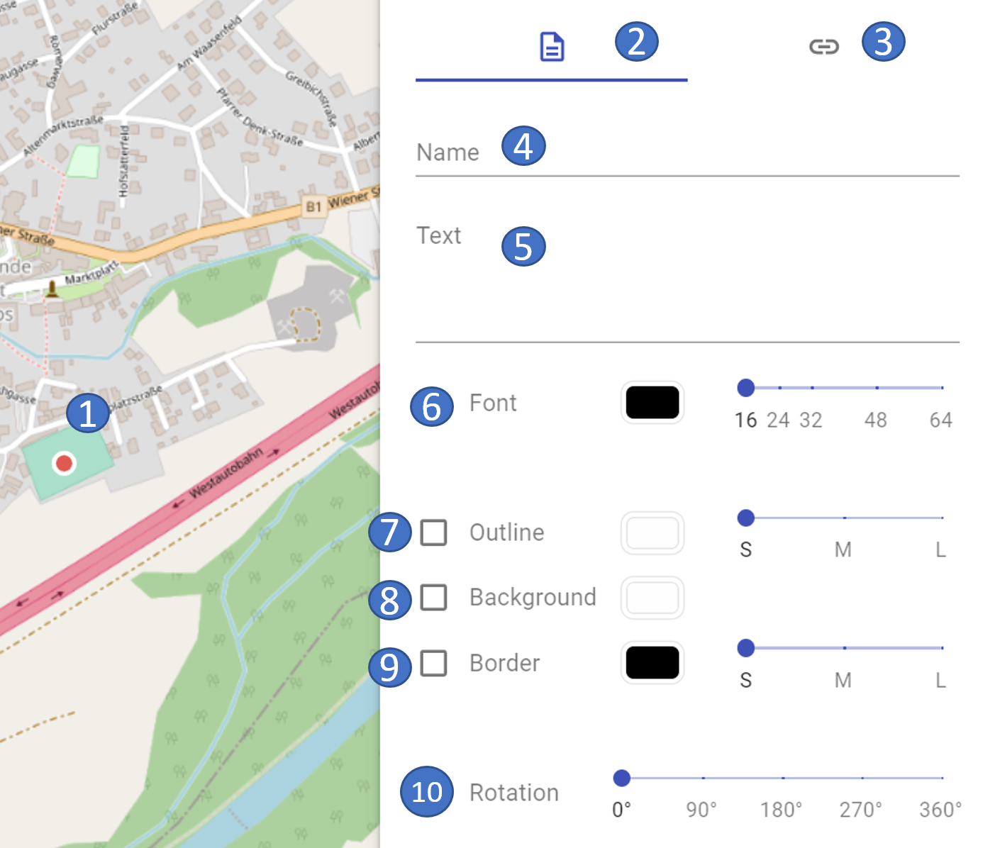
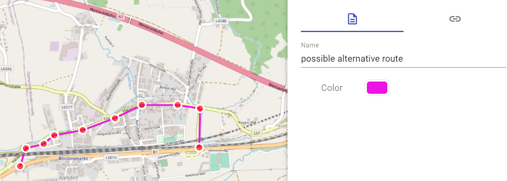
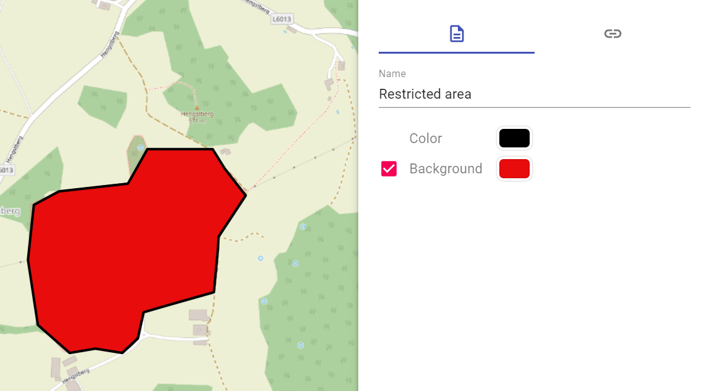

# Freeform objects

The following **freeform objects** are available in ODIN:

- Text field
- Line
- Area

## Selection in the Map Palette

To create a **Freeform Object** you have to select it in the **Map Palette** first. Enter the term **"Supplemental"** in the search area or use the search terms "**Text**", "**Line**" and "**Polygon**":

## Text field

After the **selection** in the **Map Palette** and the **click** on the desired **position** on the **map** a **"red dot"** appears and the property window opens.

The following properties can be entered for the text field:

|  |  |
| -------------------------- | -------------------------- |

- 1 marked object on the map
- 2 current area properties
- 3 switch to the links/weblinks area
- 4 name of the object *(= display in layer management)*
- 5 Input of the text *(= display on the map)*
- 6 styling options for the font (color, font size)
- 7 styling options for the border (color, width)
- 8 styling options for the background (color)
- 9 styling options for the border (color, width)
- 10 rotation of the display of the text on the map

In the free text field, in addition to text input, **emojis** can be added (on Windows with the `WINDOWS key` + `.` or on MAC with `CMD` + `CTRL` + `spacebar`). Longer texts can also be divided into paragraphs with the `ENTER` key.

With **Font** the **Color** can be selected, as well as the **Font size** can be changed (to font size 16, 24, 32, 40, 48, 56, 64).

When **Border** is selected, a colored border can be added to the text. Here you can set the **Color** and the **Width** (Small, Medium, Large) of the border.

When you select the **Background**, the **Fill** color of the text box is set.

Selecting the **Border** will add a border to the text box.  Here you can set the **color** and the **width** (Small, Medium, Large) of the frame.

With **Rotation** you can change the **Alignment** of the text field (each in 15 °-steps).

When **selecting** the **colors** a small window opens with the following choices:

- 1 selection of the color *(by means of the mouse)*
- 2 selection of color ranges *(using the mouse)*
- 3 transparency selection *(using the mouse)*
- 4 immediate display of the selection at the object on the map

To **change** the **position** of the free text field, click on it with the mouse on the **left side of the text field** and move it to the new position.

With the text field the same functionalities are possible as with the point symbols, i.e. **"Offset Location"** (hold down the `ALT` key and move the text field with the mouse), as well as **Copy** (`CTRL` + `C`) and **Paste** (`CTRL` + `V`) are also possible here.

## Line

After the **selection** in the **Map Palette** and the **clicks** on the desired **positions** on the **map** you finish the input with a **double-click**, after that the property window is opened.

The following properties can be entered for the freeform "Line":

|  |  |
| -------------------------------- | -------------------------------- |

- 1 marked object on the map
- 2 current area properties
- 3 switch to the links/weblinks area
- 4 name of the object *(= display in layer management)*
- 5 styling options for the line (color)

The choices for **color** styling are **analogous** to those for the **width text field**.

## Area

After the **selection** in the **Map Palette** and the **clicks** on the desired **positions** on the **map** you finish the input with a **double-click**, then the property window opens.

The following properties can be entered for the freeform "Area":

|  |  |
| --------------------------------- | --------------------------------- |

- 1 marked object on the map
- 2 current area properties
- 3 switch to the Links/Weblinks area
- 4 name of the object *(= display in layer management)*
- 5 styling options for the frame (color)
- 6 styling options for the background (color)

The choices for the **color selection** are **analogous** to those for the **width text field**.

