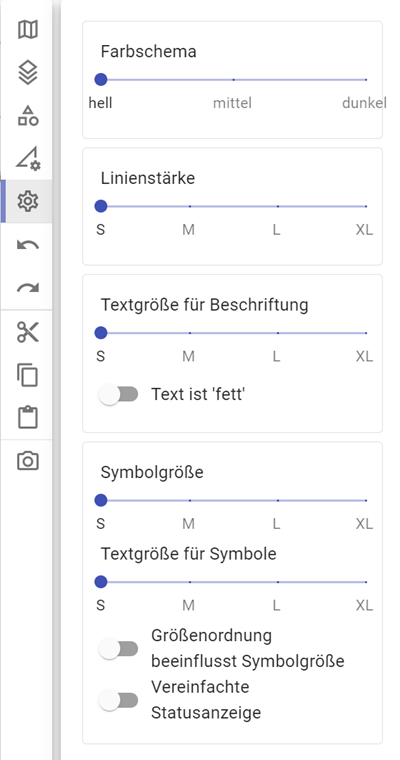
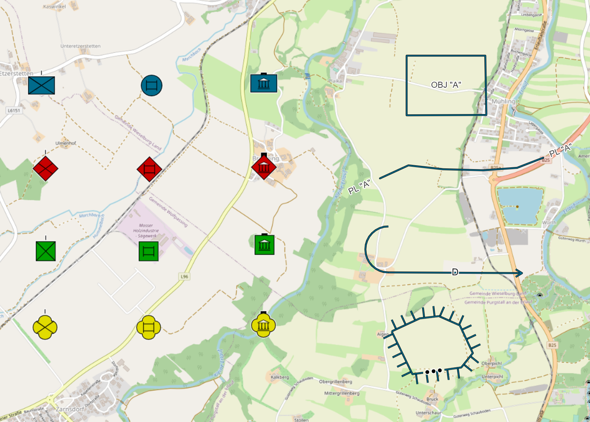
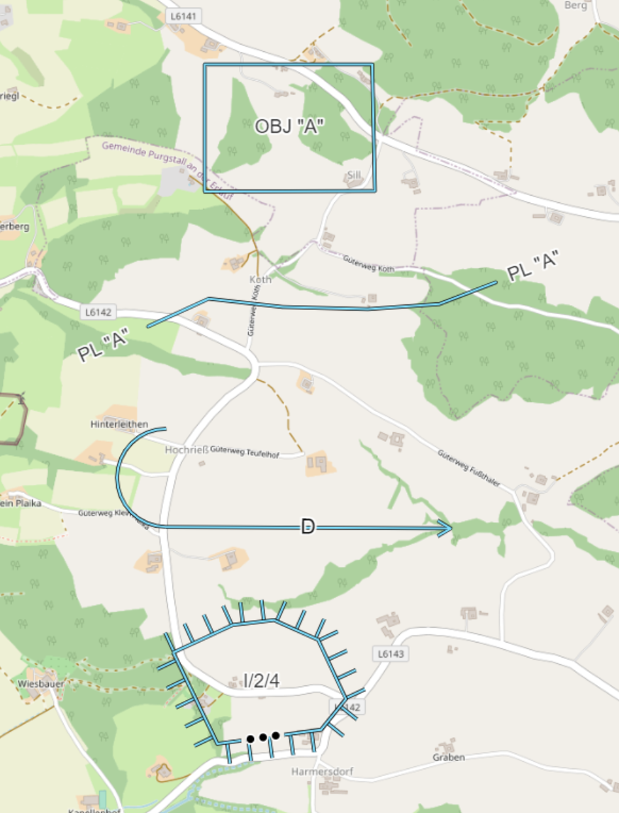
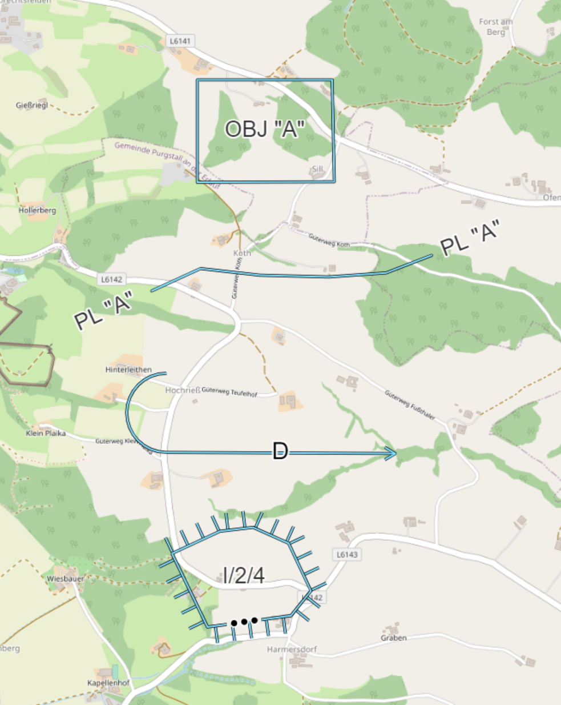
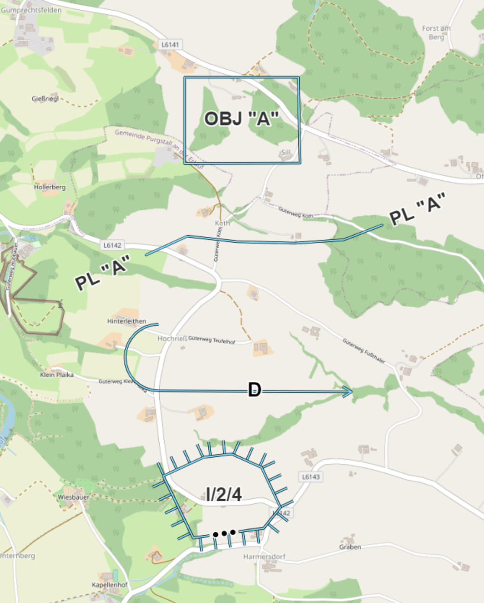
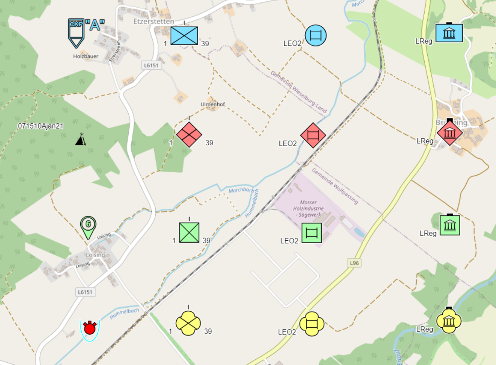
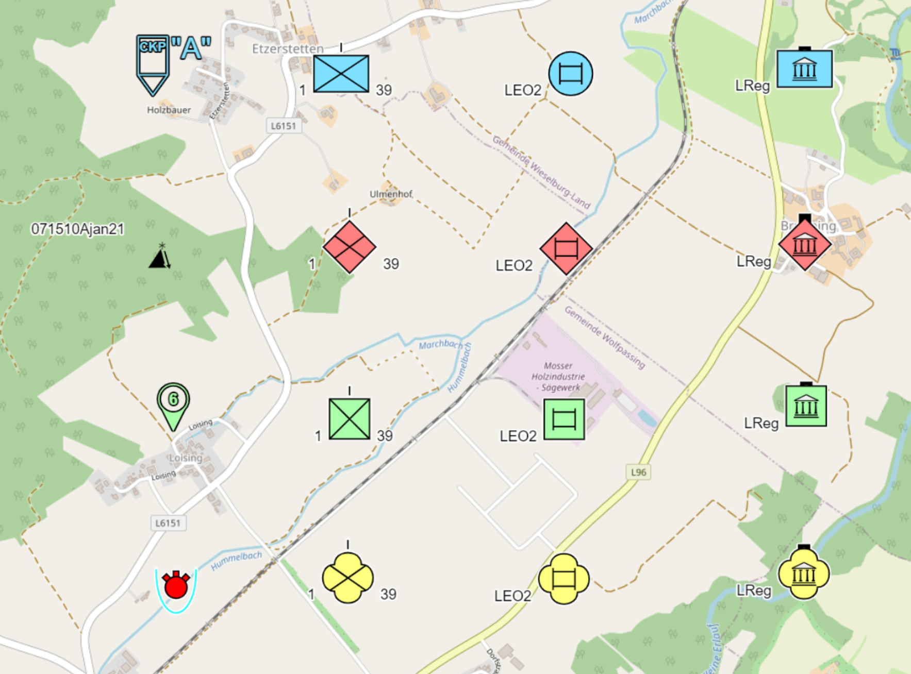
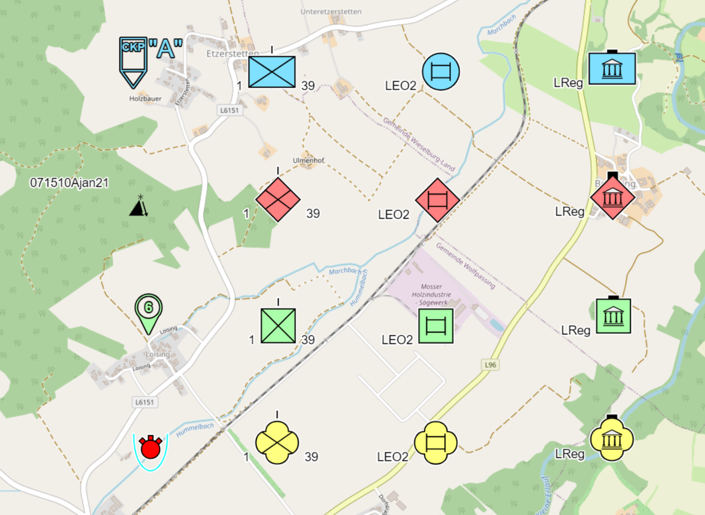

# **Einstellungen**

Im Bereich der Einstellungen sind folgende Funktionalitäten verfügbar:

## **Farbschema**

Mit **Farbschema** könnt Ihr die Objekte auf der Karte in unterschiedlicher Farbstärke (hell, mittel und dunkel) darstellen:

|  |  |  |
| :-----------------------------: | :-------------------------------: | :-------------------------------: |
|             (hell)              |             (mittel)              |             (dunkel)              |

## **Mehrpunktobjekte**

Mit **Linienstärke** könnt Ihr die Mehrpunktobjekte auf der Karte in unterschiedlicher Linienstärke (klein, mittel, groß, extragroß) darstellen:

|  |  |  |  |
| :---------------------------------: | :----------------------------------: | :---------------------------------: | :--------------------------------------: |
|               (klein)               |               (mittel)               |               (groß)                |               (extragroß)                |

Mit **Textgröße für Beschriftung** könnt Ihr die Beschriftung bei Mehrpunktobjekten auf der Karte in unterschiedlicher Größe (klein, mittel, groß, extragroß) darstellen:

|  |  |  |  |
| :--------------------------------------------: | :---------------------------------------------: | :--------------------------------------------: | :-------------------------------------------------: |
|                    (klein)                     |                    (mittel)                     |                     (groß)                     |                     (extragroß)                     |

Mit **Text ist 'fett'** könnt Ihr die Beschriftung bei Mehrpunktobjekten in "fetter" Schrift darstellen:

|  |  |  |  |
| :-------------------------------------------------: | :--------------------------------------------------: | :-------------------------------------------------: | :------------------------------------------------------: |
|                   (klein - fett)                    |                   (mittel - fett)                    |                    (groß - fett)                    |                    (extragroß - fett)                    |

## **Einpunktobjekte**

Mit **Symbolgröße** könnt Ihr die Einpunktobjekte auf der Karte in unterschiedlicher Größe (klein, mittel, groß, extragroß) darstellen bzw. wird dabei auch die Beschriftung der Objekte auf der Karte größer angezeigt:

|  |      |
| :---------------------------------: | :--------------------------------------: |
|               (klein)               |                 (mittel)                 |
|  |  |
|               (groß)                |               (extragroß)                |

Mit **Textgröße für Symbole** könnt Ihr die Beschriftung bei Einpunktobjekten auf der Karte in unterschiedlicher Größe (klein, mittel, groß, extragroß) darstellen, ohne das die Symbole mit vergrößert werden:

|  |      |
| :---------------------------------------: | :--------------------------------------------: |
|                  (klein)                  |                    (mittel)                    |
|  |  |
|                  (groß)                   |                  (extragroß)                   |

Mit **Größenordnung beeinflusst Symbolgröße** könnt Ihr einerseits die Darstellung für alle Einheiten gleich groß auf der Karte auswählen (= Funktion ist deaktiviert) oder andererseits die Einheiten aufgrund ihres Größensymbols unterschiedlich groß (= Funktion ist aktiviert) darstellen:

|  |  |
| :-----------------------------------------: | :---------------------------------------: |
|           (Funktion deaktiviert)            |           (Funktion aktiviert)            |

Die **Zuordnung** der **Symbolgrößen** bei den Einheiten wurden in ODIN wie folgt gewählt:

- 1.00  kein Größensymbol bzw. Team/Besatzung, Trupp
- 1.08  Gruppe
- 1.13  Zug
- 1.21 Kompanie
- 1.34  Bataillon/Regiment
- 1.55  Brigade aufwärts

Mit **Vereinfachte Statusanzeige** könnt Ihr den Status bei Einheiten, Ausrüstung/Gerät und Einrichtungen einerseits mit einem Balken unterhalb des Symbols ( (= Funktion ist deaktiviert) oder andererseits mittels Strichen (= Funktion ist aktiviert) darstellen:

|  |  |
| :---------------------------------------: | :-------------------------------------: |
|          (Funktion deaktiviert)           |          (Funktion aktiviert)           |

## **Beispiel**

Nachstehend seht Ihr ein Beispiel, welche Auswirkungen die Kombination der Einstellungen auf die Darstellung auf der Karte hat:

|  |
| :------------------------------------------------: |
|          (alle Einstellungen deaktiviert)          |
|    |
|             (Einstellungen aktiviert)              |

