# **Preferences**

The following functionalities are available in the preferences:

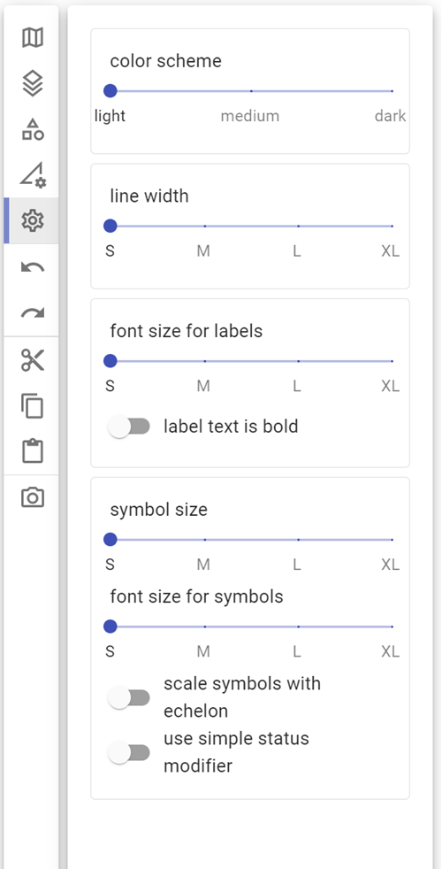

## **Color scheme**

With **Color scheme** you can display the objects on the map in different color strength (light, medium and dark):

|  | 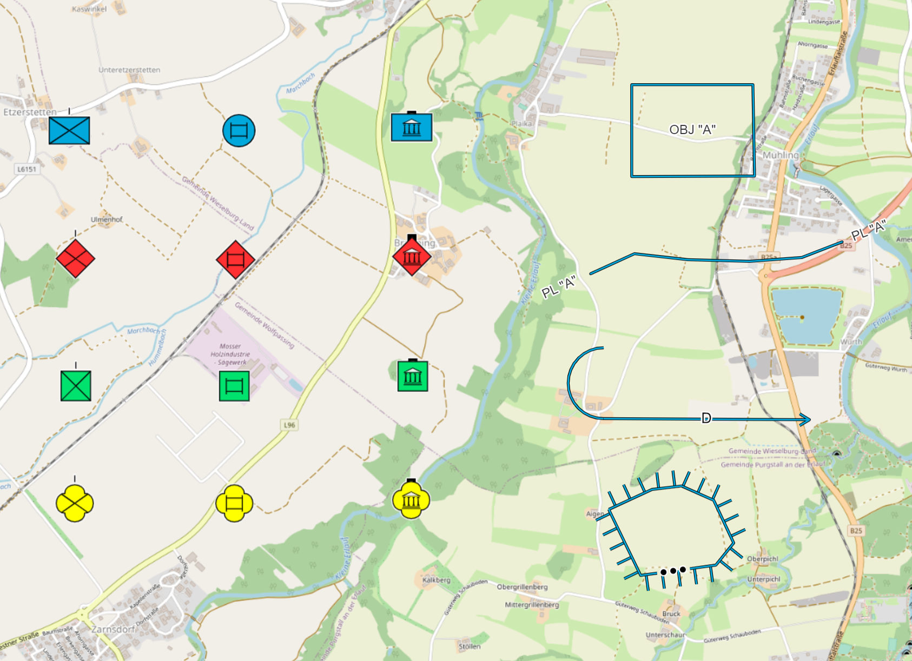 |  |
| :-----------------------------: | :-------------------------------: | :-------------------------------: |
|             (light)             |             (medium)              |              (dark)               |

## **Multi point objects**

With **Line width** you can display the multi point objects on the map in different line widths (small, medium, large, extra-large):

|  |  |  | 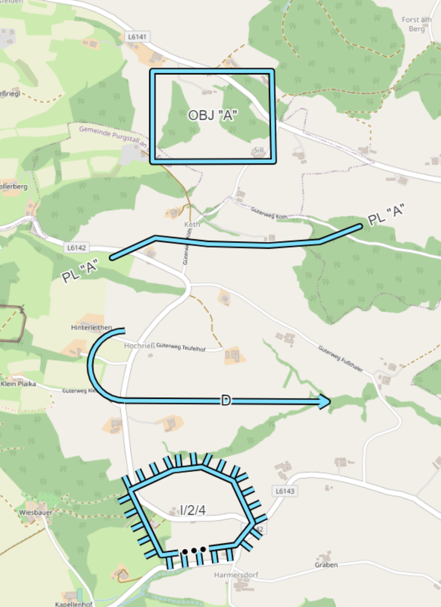 |
| :---------------------------------: | :----------------------------------: | :---------------------------------: | :--------------------------------------: |
|               (small)               |               (medium)               |               (large)               |              (extra-large)               |

With **Font size for labels** you can display the label for multi point objects on the map in different sizes (small, medium, large, extra-large):

| 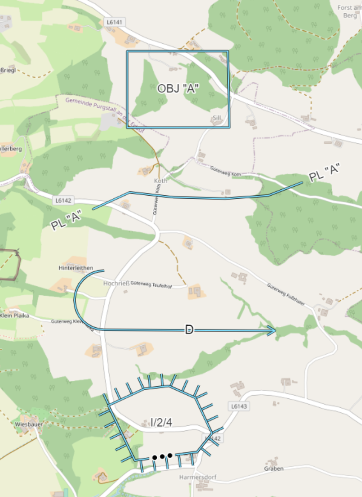 |  |  |  |
| :--------------------------------------------: | :---------------------------------------------: | :--------------------------------------------: | :-------------------------------------------------: |
|                    (small)                     |                    (medium)                     |                    (large)                     |                    (extra-large)                    |

With **Label text is bold** you can display the label for multi point objects in "bold" font:

| 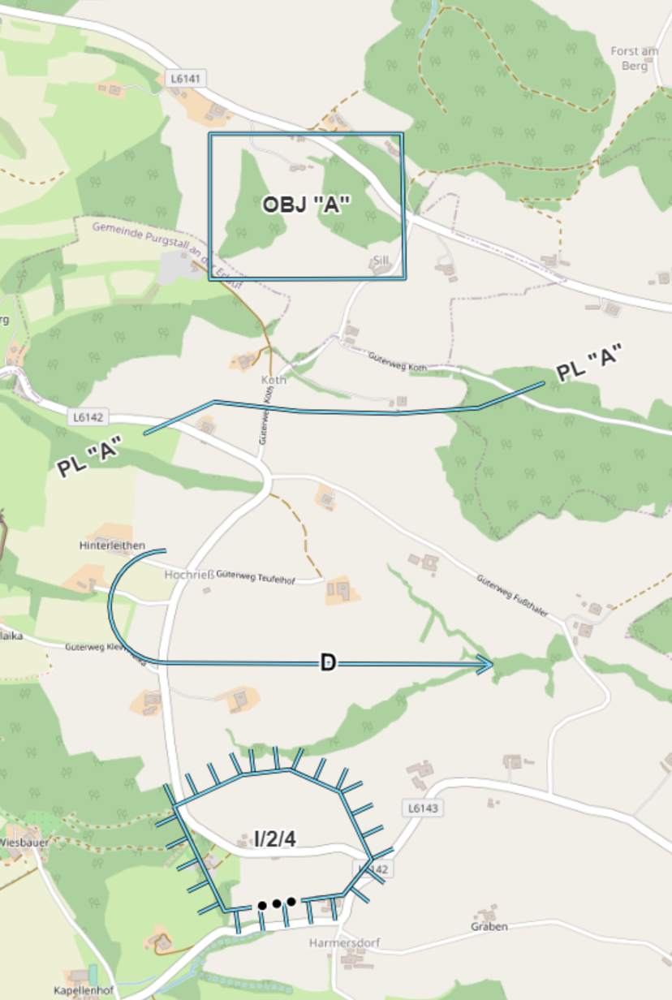 |  | 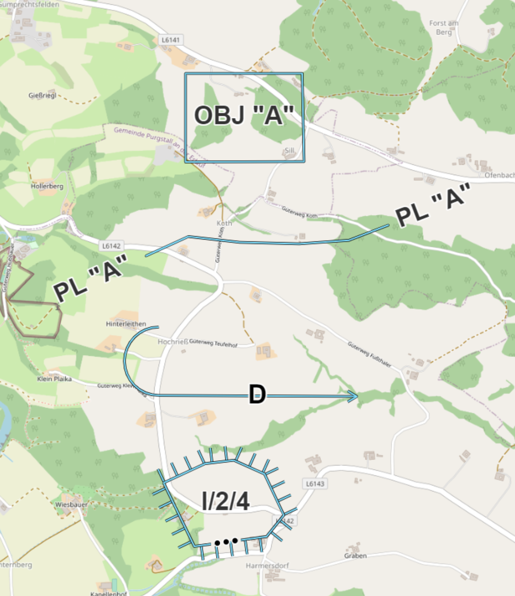 |  |
| :-------------------------------------------------: | :--------------------------------------------------: | :-------------------------------------------------: | :------------------------------------------------------: |
|                    (small- bold)                    |                   (medium - bold)                    |                   (large - bold)                    |                   (extra-large - bold)                   |

## **Single point objects**

With **Symbol size** you can display the single-point objects on the map in different sizes (small, medium, large, extra-large) and the labels of the objects on the map are also displayed larger:

|  |      |
| :---------------------------------: | :--------------------------------------: |
|               (small)               |                 (medium)                 |
|  |  |
|               (large)               |              (extra-large)               |

With **Font size for symbols** you can display the label of single point objects on the map in different sizes (small, medium, large, extra-large) without enlarging the symbols:

| 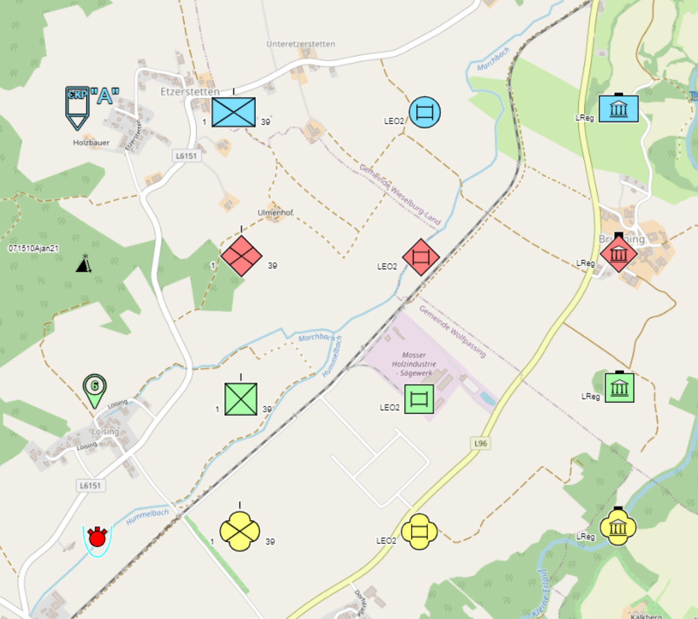 |   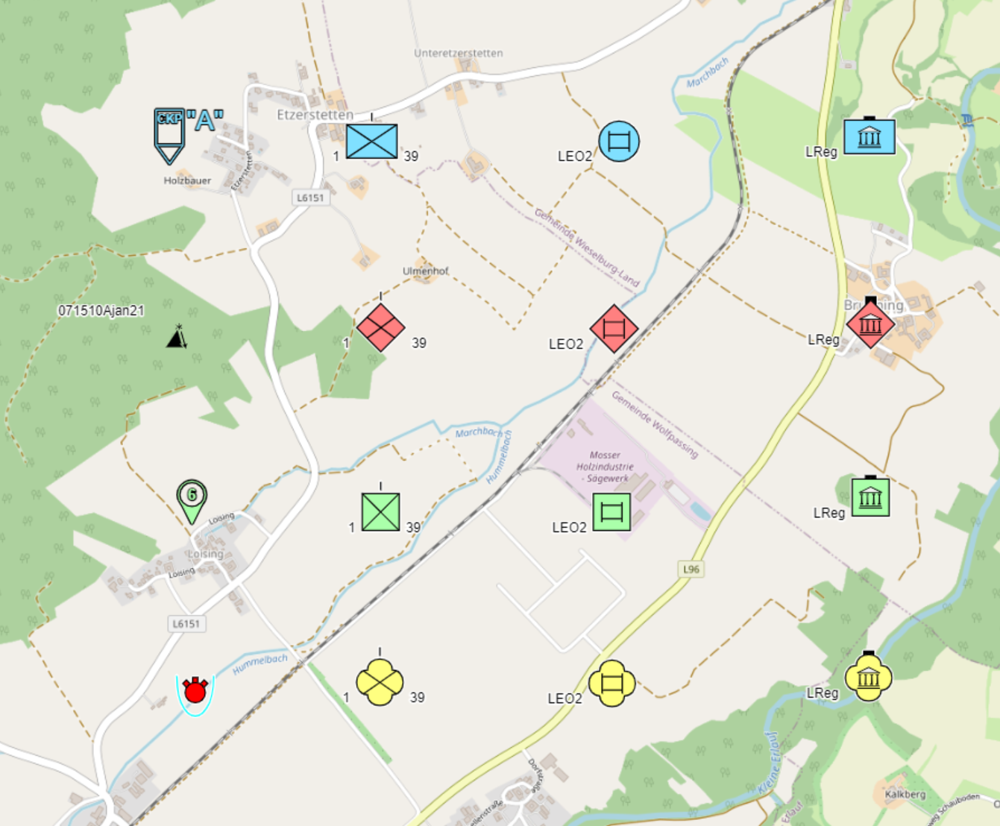   |
| :---------------------------------------: | :--------------------------------------------: |
|                  (small)                  |                    (medium)                    |
|  |  |
|                  (large)                  |                 (extra-large)                  |

With **Scale symbols with echelon** you can select on the one hand the display for all units of the same size on the map (= function is deactivated) or on the other hand display the units differently sized based on their size symbol (= function is activated):

| 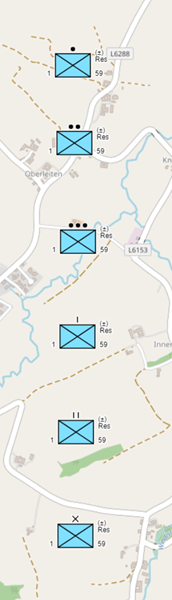 | 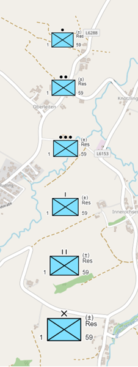 |
| :-----------------------------------------: | :---------------------------------------: |
|          (function is deactivated)          |          (function is activated)          |

The **assignment** of the **symbol sizes** at the units were chosen in ODIN as follows:

- 1.00  no size symbol resp. team/crew, squad, 
- 1.08  section
- 1.13  platoon
- 1.21 company
- 1.34  battalion/regiment
- 1.55  brigade upwards

With **Use simple status modifier** you can display the status of units, equipment and facilities on the one hand with a bar below the symbol ( = function is deactivated) or on the other hand with dashes (= function is activated):

| 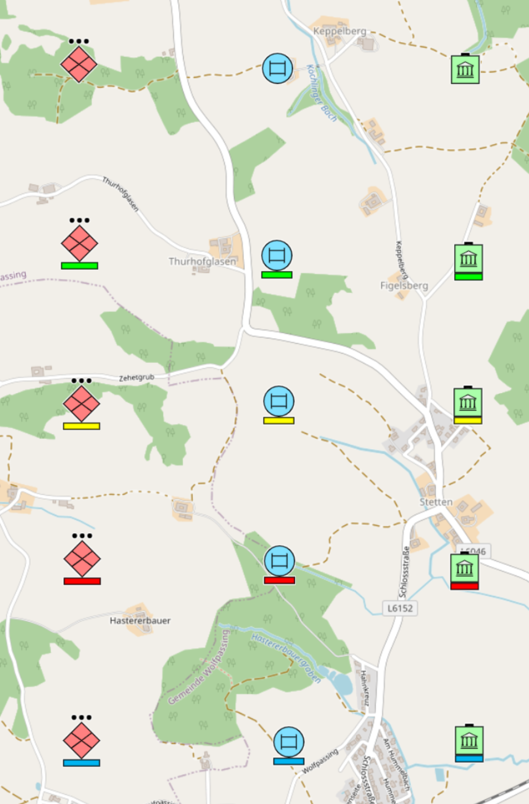 | 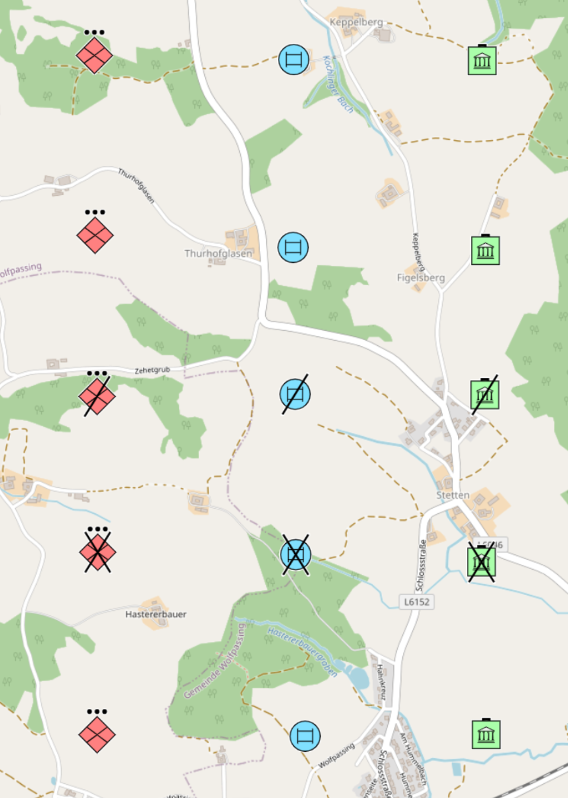 |
| :---------------------------------------: | :-------------------------------------: |
|         (function is deactivated)         |         (function is activated)         |

## **Example**

Below you can see an example of what effect the combination of settings has on the display on the map:

|  |
| :------------------------------------------------: |
|           (all preferences deactivated)            |
|    |
|              (preferences activated)               |

