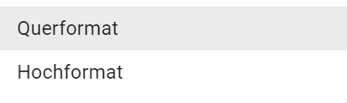
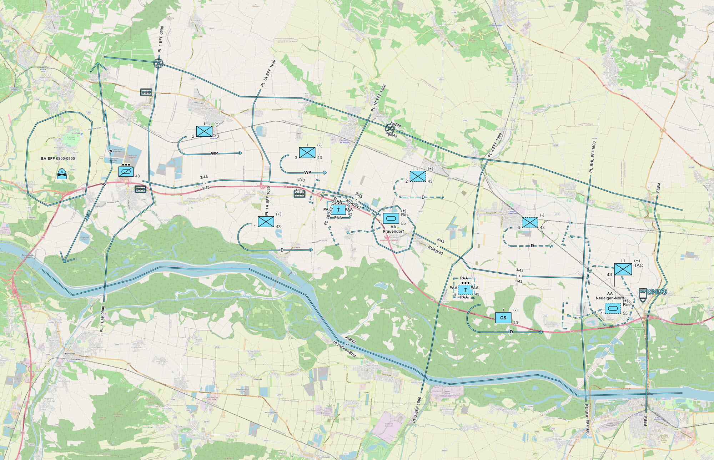
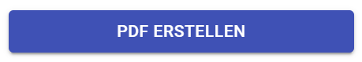
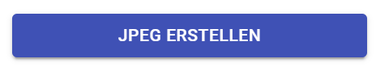
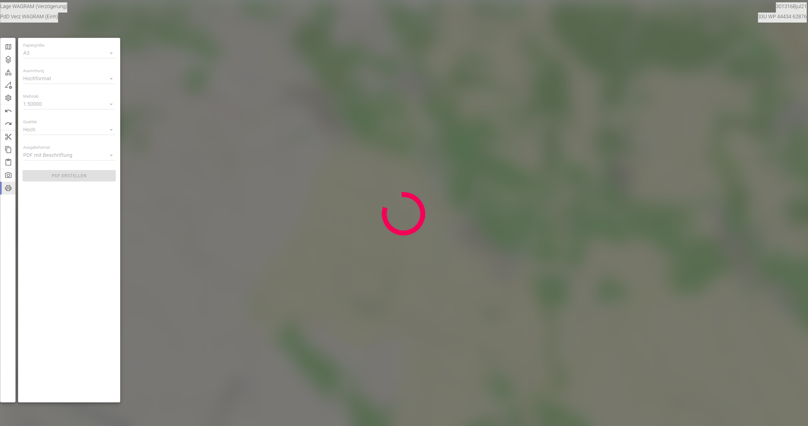

# Maßstabgerechtes Drucken

Im Bereich des Maßstabgerechten Druckens sind folgende Funktionalitäten verfügbar:

## Papiergröße

Mit **Papiergröße** könnt Ihr festlegen, ob der Ausdruck in DIN A4, A3 oder in A2 erfolgen soll.

## Ausrichtung

Mit **Ausrichtung** könnt Ihr festlegen, ob der Ausdruck im Hoch- oder Querformat erfolgen soll.

## Maßstab

Mit **Maßstab** könnt Ihr festlegen, in welchem der nachstehend angeführten Maßstäbe der Ausdruck erfolgen soll.

## Qualität

Mit **Qualität** könnt Ihr festlegen, in welcher Qualität der Ausdruck erfolgen soll.

Die Qualität beeinflusst sowohl die Darstellung der Objekte, als auch die des Karteninhaltes selbst. Hierbei ist zu beachten, je höher die Qualität, desto länger dauert der Bearbeitungsvorgang, abhängig vom verwendetem Gerät und dessen Systemkomponenten.

## Ausgabeformat

Mit **Ausgabeformat** könnt Ihr festlegen, ob der Ausdruck als Foto (JPEG Bild) oder als pdf-Datei erfolgen soll.

Beim Ausdruck als pdf-Datei, werden neben dem Lagebild auch der Zeitpunkt des Ausdrucks (in NATO-Format), die Koordinate des Kartenmittelpunktes, sowie der Maßstab und der Maßstabbalken mit angezeigt.

Beim Ausdruck als JPEG-Datei wird nur das Lagebild ausgedruckt.

## Start des Druckvorganges

Durch Drücken des **Buttons** `PDF ERSTELLEN` bzw. `JPEG ERSTELLEN` wird der Druckvorgang gestartet:

|  |  |
| :-------------------------------: | :--------------------------------: |
|     (Ausdruck als PDF-Datei)      |     (Ausdruck als JPEG-Datei)      |

## Tätigkeiten des Users beim Maßstabgerechten Druckens

Um in ODIN Euer Lagebild maßstabgerecht zu Drucken müsst Ihr folgende Tätigkeiten durchführen:

Als erstes wechselt Ihr in der **Activity Bar** in den **Bereich "Maßstabgerechtes Drucken"**. Nun seht Ihr die **Druckvorschau** (diese wird von einen weißen Rahmen umrandet).

Hier könnt Ihr nun die **gewünschten Einstellungen** für Euren Ausdruck vornehmen (die Auswirkungen der Einstellungen werden Euch unmittelbar in ODIN angezeigt). Mit der **Maus** könnt Ihr die **Karte verschieben** und so die Auswahl des **Druckbereiches** noch **verändern bzw. anpassen**.

Nach dem Drücken des Buttons `PDF ERSTELLEN` bzw. `JPEG ERSTELLEN` wird der Druckvorgang gestartet und es erscheint **während** der **Bearbeitungszeit** ein **Fenster** mit einen sich **rotierenden rosa Kreis** (dabei wird die Karte und das Lagebild ausgeblendet und der Bereich der Activity Bar inaktiv dargestellt).

Wenn die Bearbeitungsvorgang abgeschlossen ist, öffnet sich der Explorer und Ihr könnt den Ausdruck auf Eurem Gerät abspeichern und danach ausdrucken oder z.B. per E-Mail versenden.

