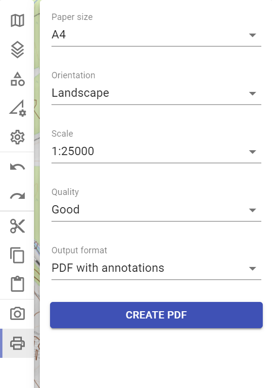
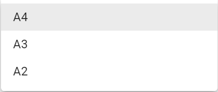
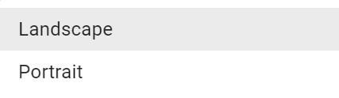
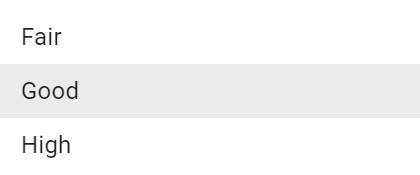

# Print to scale

The following functionalities are available in the print to scale area.

## Paper Size

With **"Paper Size"** you can define whether the paper size of the printout should be DIN A4, A3 or A2.

## Orientation

With **"Orientation"** you can define whether the printout should be in portrait or landscape format. 

## Scale

With **"Scale"** you can define in which of the following scales the printout should be made.

## Quality

With **"Quality"** you can define the quality of the printout.

The quality influences both the representation of the objects and the map content itself. Please note the higher the quality, the longer takes the processing time, depending on the equipment used and its system components.

## Output Format

With **"Output Format"** you can specify whether the printout should be a photo (JPEG-image) or a PDF-file.

When printing as a PDF-file, the time of printing (in NATO format), the coordinate of the map center point, as well as the scale and the scale bar are also displayed in addition to the situation picture as shown below.

When printing as a JPEG-file, only the situation image is printed.

## Start of the Print Process

By pressing the **button** `CREATE PDF`or `CREATE JPEG` the printing process is started.

|  |  |
| :----------------------------------: | :-----------------------------------: |
|         (print as PDF-file)          |         (print as JPEG-file)          |

## Activities of the user when printing to scale

In order to print your situation picture to scale in ODIN you must carry out the following activities.

First you change in the **Activity Bar** to the **Area "Print to scale"**. Now you see the **Print Preview** (this is surrounded by a white frame).

Here you can now make the **desired settings** for your printout (the effects of the settings are immediately displayed in ODIN). With the **mouse** you can **move the map** and thus **change or adjust**  the selection of the **printing area**.

After pressing the button `CREATE PDF` or `CREATE JPEG` the printing process will be started and **during** the **editing time** a **window** with a **rotating pink circle** will appear (the map and the location image will be hidden and the area of the Activity Bar will be displayed inactive).

When the editing process is complete, Explorer will open and you can save the printout to your device and then print it out or send it by e-mail, for example.

