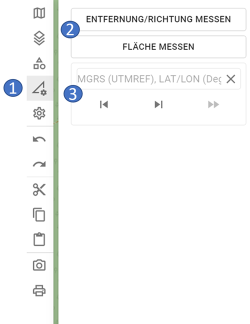
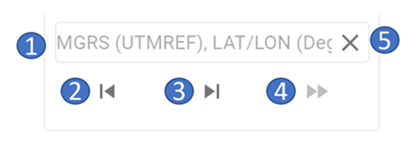
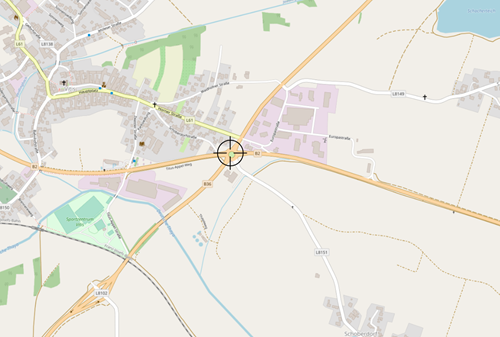
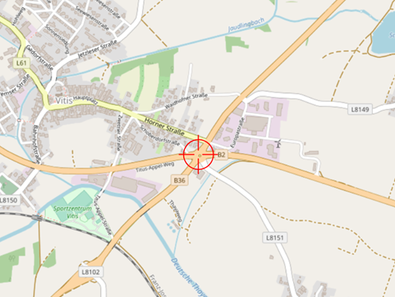

# Werkzeuge

Im Bereich der Werkzeuge sind die GIS-Funktionalitäten von ODIN verfügbar:

- 1 Bereich der Werkzeuge
- 2 verfügbare GIS-Funktionalitäten
- 3 "Zur Koordinate springen"-Funktionalität

Zu beachten ist, dass die **GIS-Funktionalitäten**, sowie die **"Zur Koordinate springen"-Funktionalität** in ODIN **nicht gespeichert** werden. Dies bedeutet, dass diese nach einem **Neustart von ODIN nicht mehr verfügbar** sind. Weiters sind die GIS-Funktionalitäten und die "Zur Koordinate springen"-Funktionalität nicht in die „Rückgängig/Wiederherstellen“-Logik mit eingebunden.

## Entfernung/Richtung messen

- 1 grüner Punkt = Startpunkt der Streckenberechnung

- 2 Distanzangabe in m/km für die Teilstrecke

- 3 Winkelangabe für die Teilstrecke in Grad

- 4 roter Punkt = Endpunkt der Streckenberechnung

- 5 Gesamtlänge der Strecke in m/km

Mit **Entfernung/Richtung messen** könnt Ihr auf der Karte die Länge einer Strecke messen. Zusätzlich zur Gesamtlänge werden für die Teilstrecken (= die Linie zwischen zwei gesetzten Punkten) auch die Länge und der Winkel dazu angegeben.

Ihr könnt dabei jederzeit die Strecke wie folgt verändern (die Änderung werden sofort mitberücksichtigt):

-   Mit der Maus auf die Linie klicken und mit dem Mauszeiger verschieben.
-   Punkte löschen, in dem Ihr die `ALT-Taste` gedrückt hält und mit der **Maus** auf die **gesetzten Punkte** der Linie **klickt**.

## Fläche messen

- 1 Distanzangabe in m/km für die Teilstrecke

- 2 Gesamtfläche in m²/km²

- 3 Umfang der Fläche in m/km

Mit **Fläche messen** könnt Ihr auf der Karte die Fläche eines Bereiches messen. Zusätzlich zur Gesamtlänge, erfolgt auch hier die Angabe der Länge zu den einzelnen Teilstrecken. In der Mitte der Fläche werden die Gesamtfläche in m²/km² (oben) und der Umfang der Fläche (darunter) angezeigt.

Das Verändern der Fläche erfolgt analog wie bei Entfernung/Richtung messen.

## "Zur Koordinate springen"-Funktionalität

- 1 Eingabebereich für die Koordinate
- 2 nach hinten blättern in der Historie
- 3 nach vorne blättern in der Historie
- 4 Ausführen der Funktion "Zur Koordinate springen"
- 5 Löschen eingegebener Koordinate

Bei der Eingabe der Koordinaten können diese derzeit in folgenden Koordinatenformate eingegeben werden:

- **MGRS/UTM Ref** (WGS84) - z.B. 33U WQ 14060 00393
- **LAT LON (Deg)** (WGS84) - z.B. 15.19130 48.75639

Somit wird das Kopieren/Einfügen von Koordinaten aus folgenden Programmen unterstützt:

- ODIN (`STRG + D`)
- Google Maps
- Open Street Map
- Apple Maps

Bei der **Eingabe** der **Koordinate** ist zu beachten:

- Ist im Eingabebereich bereits eine Koordinate vorhanden, kann dieser durch Drücken des `"Löschen"`-Button einfach geleert werden.
- Nach der Angabe der Grad (LAT LON-Koordinatenformat) ist ein **Punkt** anzuführen (erst danach kann die Eingabe weiter fortgesetzt werden).
- Nach Eingabe der letzten Zahl der LAT-Koordinate kann anstelle des Beistriches einfach die `Leertaste` gedrückt werden (der Beistrich wird dann automatisch gesetzt).
- Solange die Koordinate noch **nicht vollständig** bzw. in einem **ungültigen Format** eingegeben wurde, ist der  `"Ausführen"`-Button **deaktiviert** und die "Zur Koordinate springen"-Funktion kann nicht ausgeführt werden.

Alle vom User mit der "Zur Koordinate springen"-Funktion gesetzten Koordinaten werden **lokal gespeichert** und sind bis zum Beenden von ODIN somit verfügbar. Mit den `"Vor"`- und `"Zurück"`-Button kann in der Historie zwischen den eingegebenen Koordinaten vor und zurück gewechselt werden.

Mit dem `"Ausführen"`-Button wird auf die Koordinate "gesprungen". Dabei wird die **eingegebene Koordinate** mit einem **Fadenkreuz** zentriert in der **Mitte der Karte** dargestellt:

Wollt Ihr die Koordinate auf der Karte **löschen**, klickt Ihr das Fadenkreuz an (dieses wird nun rot dargestellt) und drückt  danach die `ENTF`-Taste:

Zu beachten ist hier, dass die gesetzte Koordinate jedoch noch immer in der Historie erhalten bleibt!
