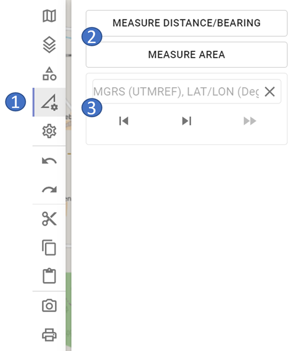

# Measurement Tools

In the measurement tools section the GIS functionalities of ODIN are available:

- 1 tools area
- 2 available GIS functionalities
- 3 "Jump to Coordinate" functionality

It should be noted that **GIS functionalities** and the **"Jump to Coordinate" functionality** are **not stored** in ODIN. This means that they **will not be available after a restart of ODIN**. Furthermore, the GIS functionalities and the "Jump to coordinate" functionality are not included in the "Undo/Redo" logic.

## Measure distance/direction

- 1 green point = starting point of the distance calculation

- 2 distance specification in m/km for the partial distance
- 3 angle specification for the partial distance in degrees
- 4 red point = end point of the distance calculation
- 5 total length of the route in m/km

With **Measure distance/direction** you can measure the length of a route on the map. In addition to the total length, for the partial distances (= the line between two set points) also the length and the angle to it are indicated.

You can change the distance at any time as follows (the change will be taken into account immediately):

- Click with the mouse on the line and move it with the mouse pointer.
- Delete a point by holding down the `ALT key` and **clicking** on the **point of the line** to **delete**.

## Measure area

- 1 distance specification in m/km for the partial distance

- 2 total area in m²/km²
- 3 perimeter of the area in m/km

With **Measure area** you can measure the area of an area on the map. In addition to the total length, the length to the individual sections is also given here. In the center of the area, the total area in m²/km² (above) and the perimeter of the area (below) are displayed.

The changing of the area is done analogous to the measuring of distance/direction.

## "Jump to Coordinate" functionality

- 1 input coordinates
- 2 scroll backward in history
- 3 scroll forward in history
- 4 execute the function "Jump to Coordinate"
- 5 delete entered coordinate

When entering coordinates, they can currently be entered in the following coordinate formats:

- **MGRS/UTM Ref** (WGS84) - e.g. 33U WQ 14060 00393
- **LAT LON (Deg)** (WGS84) - e.g. 15.19130 48.75639

Thus the copy/paste of coordinates from following programs are supported:

- ODIN (`STRG + D`)
- Google Maps
- Open Street Map
- Apple Maps

When **entering** the **coordinate** please note:

- If there is already a coordinate in the input area, it can be simply cleared by pressing the `"Clear"` button.
- After entering the degrees (LAT LON coordinate format), a **point** must be entered (only then can the input be continued).
- After entering the last number of LAT coordinate, the `"Space"` button can simply be pressed instead of the comma (the comma is then set automatically).
- As long as the coordinate is **not complete** or entered in an **invalid format**, the `"Execute"` button is **disabled** and the "Jump to coordinate"-function cannot be executed.

All coordinates set by user with "Jump to Coordinate" function are **locally stored** and are thus available until ODIN is closed. With the `"Forward"`- and `"Back"`-Buttons it is possible to switch back and forth in the history between the coordinates entered.

The `"Execute"`-Button is used to "jump" to coordinate. The **entered coordinate** is displayed centered in **center of map** with a **crosshair**:

If you want to **delete** the coordinate on map, click on the crosshairs (they will now be displayed in red) and then press the `ENTF` key:

It should be noted here that the set coordinate is still retained in the history, however!
