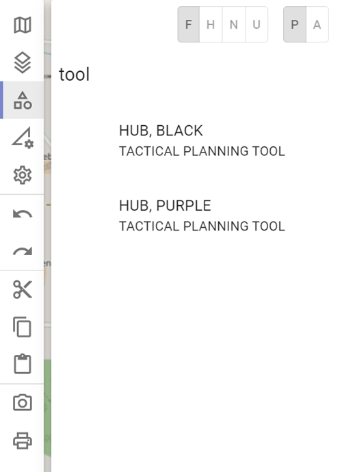
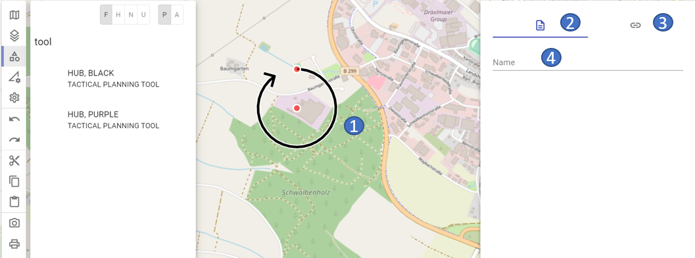

# Tactical Planning Tools

Currently, the following **Tactical Planning Tools** are available in ODIN:

- "Hub"

## Selection in the Map Palette

To create a **Tactical Planning Tool** you have to select it in the **Map Palette** first. Enter the terms **"Planning "** or **"Tool "** in the search area or use the search term "**Hub**":

## "Hub"

After the **selection** in the **Map Palette** and the **click** on the desired **position** on the **map**, the "Hub" appears and the properties window opens.

The following properties can currently be entered for the text field:

- 1 marked object on the map

- 2 current area properties

- 3 switch to the links/weblinks area

- 4 name of the object *(= display in layer management)*

  

In field **"Name "** you can enter a free text, this will then be displayed accordingly in the layer management.

The "Hub" can only be displayed in the **colors "Black "** (for tactics) and **"Purple "** (for logistics):

