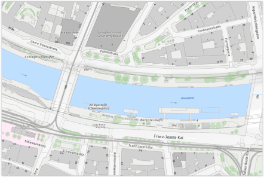
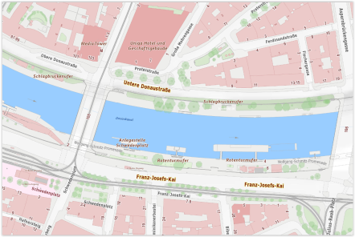
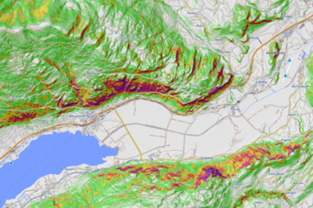
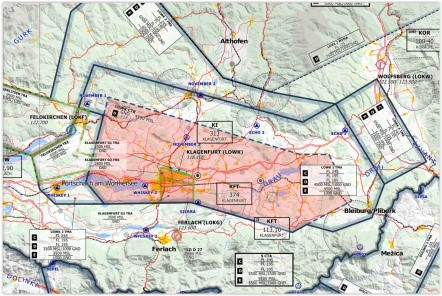
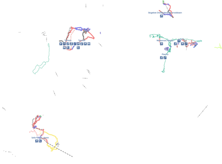
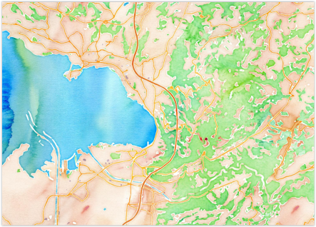
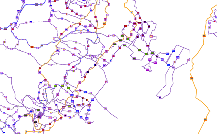
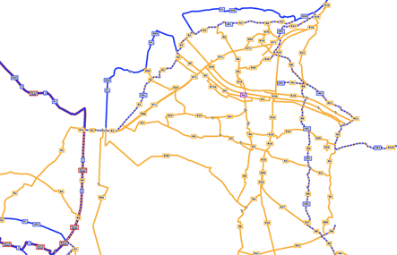
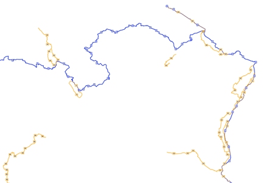

# Onlinekarten

Im Kapitel "**Kartenverwaltung**" ist das Einbinden von Online- und Offlinekarten durch den User beschrieben.

Nachstehend findet Ihr die **Eingaben**, welche im **Schritt 1 (URL eingeben)** und im **Schritt 4 ("Namensnennungen")** für im Internet **kostenlos verfügbare Onlinekarten** genützt werden können, damit Ihr diese in ODIN einbinden und die "Herkunft" der Karte anzeigen könnt:

## Basemap

| URL:                                                 | https://www.basemap.at/wmts/1.0.0/WMTSCapabilities.xml       |
| ---------------------------------------------------- | ------------------------------------------------------------ |
| im Schritt 2 auswählen:                              | Geoland Basemap –  Basemap von Österreich in Farbe           |
|                                                      |                                                              |
| **„Quelle“/Anbieter angeben**:                       | https://www.basemap.at/                                      |
| Im Schritt 4 bei **Namensnennungen** hineinkopieren: | `Karte: <a href="https://basemap.at/#lizenz">basemap.at</a>` |
|                                                      |                                                              |
| **Karteninhalt**:                                    | Österreichkarte in Farbe                                     |
|                                                      |                                                              |
| **Vorschaubild:**                                    |                                 |

| URL:                                                 | https://www.basemap.at/wmts/1.0.0/WMTSCapabilities.xml       |
| ---------------------------------------------------- | ------------------------------------------------------------ |
| im Schritt 2 auswählen:                              | Geoland Basemap Overlay –  Basemap von Österreich nur Beschriftung als transparenter Layer |
|                                                      |                                                              |
| **„Quelle“/Anbieter angeben**:                       | https://www.basemap.at/                                      |
| Im Schritt 4 bei **Namensnennungen** hineinkopieren: | `Karte: <a href="https://basemap.at/#lizenz">basemap.at</a>` |
|                                                      |                                                              |
| **Karteninhalt**:                                    | Transparenter Layer mit Bezeichnungen (z.B. Verwaltungsgrenzen, Orts- und Straßennamen, Hausnummern, U-Bahnlinien, Gewässerbezeichnungen, Berggipfel, Denkmäler etc. |
|                                                      |                                                              |
| **Vorschaubild**:                                    |                   |

| URL:                                                 | https://www.basemap.at/wmts/1.0.0/WMTSCapabilities.xml       |
| ---------------------------------------------------- | ------------------------------------------------------------ |
| im Schritt 2 auswählen:                              | Geoland Basemap –  Basemap von Österreich in Grau            |
|                                                      |                                                              |
| **„Quelle“/Anbieter angeben**:                       | https://www.basemap.at/                                      |
| Im Schritt 4 bei **Namensnennungen** hineinkopieren: | `Karte: <a href="https://basemap.at/#lizenz">basemap.at</a>` |
|                                                      |                                                              |
| **Karteninhalt**:                                    | Österreichkarte in Grau                                      |
|                                                      |                                                              |
| **Vorschaubild**:                                    |                                  |

| URL:                                                 | https://www.basemap.at/wmts/1.0.0/WMTSCapabilities.xml       |
| ---------------------------------------------------- | ------------------------------------------------------------ |
| im Schritt 2 auswählen:                              | Basemap High DPl – Basemap mit 512x512px Kacheln für Unterstützung von User Endgeräten mit high dpi Display (iPad retina, Smartphones mit HD Auflösung |
|                                                      |                                                              |
| **„Quelle“/Anbieter angeben**:                       | https://www.basemap.at/                                      |
| Im Schritt 4 bei **Namensnennungen** hineinkopieren: | `Karte: <a href="https://basemap.at/#lizenz">basemap.at</a>` |
|                                                      |                                                              |
| **Karteninhalt**:                                    | Österreichkarte in Farbe (HDPI) für Endgeräte mit HDPI-Display |
|                                                      |                                                              |
| **Vorschaubild**:                                    |                            |

| URL:                                                 | https://www.basemap.at/wmts/1.0.0/WMTSCapabilities.xml       |
| ---------------------------------------------------- | ------------------------------------------------------------ |
| im Schritt 2 auswählen:                              | Geoland Basemap Orthofoto – Basemap als farbiges Orthofoto   |
|                                                      |                                                              |
| **„Quelle“/Anbieter angeben**:                       | https://www.basemap.at/                                      |
| Im Schritt 4 bei **Namensnennungen** hineinkopieren: | `Karte: <a href="https://basemap.at/#lizenz">basemap.at</a>` |
|                                                      |                                                              |
| **Karteninhalt**:                                    | Österreichkarte als farbiges Orthofoto                       |
|                                                      |                                                              |
| **Vorschaubild**:                                    |                                 |

| URL:                                                 | https://www.basemap.at/wmts/1.0.0/WMTSCapabilities.xml       |
| ---------------------------------------------------- | ------------------------------------------------------------ |
| im Schritt 2 auswählen:                              | Geoland Basemap Gelände – Basemap Geländedarstellung  von Österreich in Grau |
|                                                      |                                                              |
| **„Quelle“/Anbieter angeben**:                       | https://www.basemap.at/                                      |
| Im Schritt 4 bei **Namensnennungen** hineinkopieren: | `Karte: <a href="https://basemap.at/#lizenz">basemap.at</a>` |
|                                                      |                                                              |
| **Karteninhalt**:                                    | Österreichkarte mit Geländedarstellung (in grau)             |
|                                                      |                                                              |
| **Vorschaubild**:                                    |                         |

| URL:                                                 | https://www.basemap.at/wmts/1.0.0/WMTSCapabilities.xml       |
| ---------------------------------------------------- | ------------------------------------------------------------ |
| im Schritt 2 auswählen:                              | Geoland Basemap Oberfläche – Basemap Oberflächendarstellung von Österreich in Grau |
|                                                      |                                                              |
| **„Quelle“/Anbieter angeben**:                       | https://www.basemap.at/                                      |
| Im Schritt 4 bei **Namensnennungen** hineinkopieren: | `Karte: <a href="https://basemap.at/#lizenz">basemap.at</a>` |
|                                                      |                                                              |
| **Karteninhalt**:                                    | Österreichkarte mit Oberflächendarstellung (in grau)         |
|                                                      |                                                              |
| **Vorschaubild**:                                    |                         |

## OpenTopoMap

| URL:                                                     | https://tile.opentopomap.org/{z}/{x}/{y}.png                 |
| -------------------------------------------------------- | ------------------------------------------------------------ |
|                                                          |                                                              |
| **„Quelle“/Anbieter angeben**:                           | https://opentopomap.org/about                                |
| Im Schritt 4 bei **Namensnennungen** hineinkopieren: | `Karte: <a href="https://www.opentopomap.org/about">opentopomap.org</a>` |
|                                                          |                                                              |
| **Karteninhalt**:                                        | Topografische Karte die aus Daten der OpenStreetMap und SRTM-Höhendaten generiert wird |
|                                                          |                                                              |
| **Vorschaubild**:                                        |                                   |

## OpenSlopeMap

| URL:                                                       | https://wmts.openslopemap.org/wmts                           |
| ---------------------------------------------------------- | ------------------------------------------------------------ |
|                                                            |                                                              |
| **„Quelle“/Anbieter angeben**:                             | [https://www.openslopemap.org](https://www.openslopemap.org/) |
| Im Schritt 4 bei **Namensnennungen**   hineinkopieren: | `Karte: <a href="https://www.openslopemap.org/projekt/lizenzen/">OpenSlopeMap.at</a>` |
|                                                            |                                                              |
| **Karteninhalt**:                                          | dzt. 26 Kartensätze für verschiedene Gebiete im Alpenraum und die Pyrenäen verfügbar (Hangneigungen, Höhenschichtlinien) |
|                                                            |                                                              |
| **Vorschaubild**:                                          |                                  |

## OpenFlightMap

| URL:                                                 | https://snapshots.openflightmaps.org/live/1712/tiles/world/noninteractive/epsg3857/merged/512/latest/{z}/{x}/{y}.png |
| ---------------------------------------------------- | ------------------------------------------------------------ |
|                                                      |                                                              |
| **„Quelle“/Anbieter angeben**:                       | [www.openflightmap.org](http://www.openflightmap.org)        |
| Im Schritt 4 bei **Namensnennungen** hineinkopieren: | `Karte: <a href="https://www.openflightmaps.org/">openflightmap.org</a>` |
|                                                      |                                                              |
| **Karteninhalt**:                                    | Einblenden der Luftraumordnung im Europäischen Raum          |
|                                                      |                                                              |
| **Vorschaubild**:                                    |                                 |

## OpenRailwayMap

| URL:                                                 | http://tiles.openrailwaymap.org/standard/{z}/{x}/{y}.png     |
| ---------------------------------------------------- | ------------------------------------------------------------ |
|                                                      |                                                              |
| **„Quelle“/Anbieter angeben**:                       | [www.openrailwaymap.org](http://www.openrailwaymap.org)      |
| Im Schritt 4 bei **Namensnennungen** hineinkopieren: | `Karte: <a href="https://www.openrailwaymap.org/imprint-de.html">openrailwaymap.org</a>` |
|                                                      |                                                              |
| **Karteninhalt**:                                    | Einblenden von Eisenbahn- und U-Bahn-, S-Bahnlinien, Bahnhöfen, Stationen etc. |
|                                                      |                                                              |
| **Vorschaubild**:                                    |                       |

| URL:                                                 | http://tiles.openrailwaymap.org/signals/{z}/{x}/{y}.png      |
| ---------------------------------------------------- | ------------------------------------------------------------ |
|                                                      |                                                              |
| **„Quelle“/Anbieter angeben**:                       | [www.openrailwaymap.org](http://www.openrailwaymap.org)      |
| Im Schritt 4 bei **Namensnennungen** hineinkopieren: | `Karte: <a href="https://www.openrailwaymap.org/imprint-de.html">openrailwaymap.org</a>` |
|                                                      |                                                              |
| **Karteninhalt**:                                    | Einblenden der Signalanlagen für den Schienenverkehr         |
|                                                      |                                                              |
| **Vorschaubild**:                                    |                        |

| URL:                                                 | http://tiles.openrailwaymap.org/maxspeed/{z}/{x}/{y}.png     |
| ---------------------------------------------------- | ------------------------------------------------------------ |
|                                                      |                                                              |
| **„Quelle“/Anbieter angeben**:                       | [www.openrailwaymap.org](http://www.openrailwaymap.org)      |
| Im Schritt 4 bei **Namensnennungen** hineinkopieren: | `Karte: <a href="https://www.openrailwaymap.org/imprint-de.html">openrailwaymap.org</a>` |
|                                                      |                                                              |
| **Karteninhalt**:                                    | Einblenden der Geschwindigkeitsbereiche für den Schienenverkehr |
|                                                      |                                                              |
| **Vorschaubild**:                                    |                       |

## OpenSeaMap

| URL:                                                       | http://t1.openseamap.org/seamark/{z}/{x}/{y}.png             |
| ---------------------------------------------------------- | ------------------------------------------------------------ |
|                                                            |                                                              |
| **„Quelle“/Anbieter angeben**:                             | [www.openseamap.org](http://www.openseamap.org)              |
| Im Schritt 4 bei **Namensnennungen**   hineinkopieren: | `Karte: <a href="https://www.openseamap.org/index.php?id=imprint">openseamap.org</a>` |
|                                                            |                                                              |
| **Karteninhalt**:                                          | Einblenden von maritimen Daten (z.B. Häfen, Leuchtfeuer, Korridore etc.) |
|                                                            |                                                              |
| **Vorschaubild**:                                          |                                    |

## OpenFireMap

| URL:                                                 | http://openfiremap.org/hytiles/{z}/{x}/{y}.png               |
| ---------------------------------------------------- | ------------------------------------------------------------ |
|                                                      |                                                              |
| **„Quelle“/Anbieter angeben**:                       | [www.openfiremap.org](http://www.openfiremap.org)            |
| Im Schritt 4 bei **Namensnennungen** hineinkopieren: | `Karte: <a href="https://www.openstreetmap.org/copyright">Open Street Map - Mitwirkende</a>` |
|                                                      |                                                              |
| **Karteninhalt**:                                    | Einblenden von Feuerwehrstützpunkten, Hydranten etc. (sofern in OpenFireMap verfügbar) |
|                                                      |                                                              |
| **Vorschaubild**:                                    |                                   |

## OpenSnowMap

| URL:                                                       | http://www.opensnowmap.org/pistes/{z}/{x}/{y}.png            |
| ---------------------------------------------------------- | ------------------------------------------------------------ |
|                                                            |                                                              |
| **„Quelle“/Anbieter angeben**:                             | [www.opensnowmap.org](http://www.opensnowmap.org)            |
| Im Schritt 4 bei **Namensnennungen**   hineinkopieren: | `Karte: <a href="https://www.openstreetmap.org/copyright">Open Street Map - Mitwirkende</a>` |
|                                                            |                                                              |
| **Karteninhalt**:                                          | Einblenden von Wintersportanlagen (weltweit)                 |
|                                                            |                                                              |
| **Vorschaubild**:                                          |                                   |

## Stamen

| URL:                                                       | http://tile.stamen.com/toner/{z}/{x}/{y}.png                 |
| ---------------------------------------------------------- | ------------------------------------------------------------ |
|                                                            |                                                              |
| **„Quelle“/Anbieter angeben**:                             | https://stamen.com/open-source                               |
| Im Schritt 4 bei **Namensnennungen**   hineinkopieren: | `Karte: <a href="https://stamen.com/privacy-policy">stamen.com</a>` |
|                                                            |                                                              |
| **Karteninhalt**:                                          | Schwarz-Weiß-Karte                                           |
|                                                            |                                                              |
| **Vorschaubild**:                                          |                                  |

| URL:                                                       | http://tile.stamen.com/terrain/{z}/{x}/{y}.jpg               |
| ---------------------------------------------------------- | ------------------------------------------------------------ |
|                                                            |                                                              |
| **„Quelle“/Anbieter angeben**:                             | https://stamen.com/open-source                               |
| Im Schritt 4 bei **Namensnennungen**   hineinkopieren: | `Karte: <a href="https://stamen.com/privacy-policy">stamen.com</a>` |
|                                                            |                                                              |
| **Karteninhalt**:                                          | Karte mit Darstellung des Geländes mit  Hügelschattierungen und natürlichen Vegetationsfarben |
|                                                            |                                                              |
| **Vorschaubild**:                                          |                                |

| URL:                                                       | http://tile.stamen.com/watercolor/{z}/{x}/{y}.jpg            |
| ---------------------------------------------------------- | ------------------------------------------------------------ |
|                                                            |                                                              |
| **„Quelle“/Anbieter angeben**:                             | https://stamen.com/open-source                               |
| Im Schritt 4 bei **Namensnennungen**   hineinkopieren: | `Karte: <a href="https://stamen.com/privacy-policy">stamen.com</a>` |
|                                                            |                                                              |
| **Karteninhalt**:                                          | Aquarellkarte mit Rastereffekten                             |
|                                                            |                                                              |
| **Vorschaubild**:                                          |                             |

## GIS-Karte Burgenland

| URL:                                                  | https://gis.bgld.gv.at/gisbgld/rest/services/Public/Grundkarte/MapServer/WMTS/1.0.0/WMTSCapabilities.xml |
| ----------------------------------------------------- | ------------------------------------------------------------ |
|                                                       |                                                              |
| **„Quelle“/Anbieter angeben**:                        | https://gis.bgld.gv.at                                       |
| Im Schritt 4 bei **Namensnennungen**  hineinkopieren: | `Karte: <a href="https://geodaten.bgld.gv.at/de/allg-informationen/nutzungsbedingungen.html"“>geodaten.bgld.gv.at</a>` |
|                                                       |                                                              |
| **Karteninhalt**:                                     | Karte des Burgenlandes mit Geo-Daten (z.B. Straßen, Gewässer, öffentliche DSt, Grundstücke etc.) |
|                                                       |                                                              |
| **Vorschaubild**:                                     |                                      |

## SwissTopo

| URL:                                                       | http://wmts.geo.admin.ch/1.0.0/WMTSCapabilities.xml          |
| ---------------------------------------------------------- | ------------------------------------------------------------ |
| im Schritt 2 auswählen:                                    | eine von den dzt. 506 verfügbaren Karten auswählen           |
|                                                            |                                                              |
| **„Quelle“/Anbieter angeben**:                             | [www.swisstopo.admin.ch](http://www.swisstopo.admin.ch)      |
| Im Schritt 4 bei **Namensnennungen**   hineinkopieren: | `Karte: <a href="https://www.admin.ch/gov/de/start/rechtliches.html">geo.admin.ch</a>` |
|                                                            |                                                              |
| **Karteninhalt**:                                          | z.B. Bewuchs, Straßen, Kulturgüter, Gewässer, Verwaltungsgrenzen,  Mobilfunkbelastung,  Energie, Lärmbelastung, Schutzgebiete, Verbreitung von Pflanzen etc.) |
|                                                            |                                                              |
| **Vorschaubild**:                                          |                                     |

## ÖPNV-Karte

| URL:                                                  | http://tile.memomaps.de/tilegen/{z}/{x}/{y}.png              |
| ----------------------------------------------------- | ------------------------------------------------------------ |
|                                                       |                                                              |
| **„Quelle“/Anbieter angeben**:                        | http://www.öpnvkarte.de                                      |
| Im Schritt 4 bei **Namensnennungen**  hineinkopieren: | `Karte: <a href="http://www.öpnvkarte.de">memomaps.de/Open Street Map - Mitwirkende</a>` |
|                                                       |                                                              |
| **Karteninhalt**:                                     | Karte mit Transportwegen (Straßen, Eisenbahn, U-Bahn, Bus, Fähren etc.) sowie von Umstiegpunkten (Flughafen, Haltestellen etc.) |
|                                                       |                                                              |
| **Vorschaubild**:                                     |                                         |

## WayMarketTrails

| URL:                                                  | https://tile.waymarkedtrails.org/hiking/{z}/{x}/{y}.png      |
| ----------------------------------------------------- | ------------------------------------------------------------ |
|                                                       |                                                              |
| **„Quelle“/Anbieter angeben**:                        | [www.waymarkedtrails.org](http://www.waymarkedtrails.org)    |
| Im Schritt 4 bei **Namensnennungen**  hineinkopieren: | `Karte: <a href="https://hiking.waymarkedtrails.org/help/legal">waymarkedtrails.org</a>` |
|                                                       |                                                              |
| **Karteninhalt**:                                     | Einblenden von markierten Wanderwegen und Standorten von Wegweisern (SG Europa, einzelne weltweit). *Wird ständig erweitert!* |
|                                                       |                                                              |
| **Vorschaubild**:                                     |                           |

| URL:                                                  | https://tile.waymarkedtrails.org/cycling/{z}/{x}/{y}.png     |
| ----------------------------------------------------- | ------------------------------------------------------------ |
|                                                       |                                                              |
| **„Quelle“/Anbieter angeben**:                        | [www.waymarkedtrails.org](http://www.waymarkedtrails.org)    |
| Im Schritt 4 bei **Namensnennungen**  hineinkopieren: | `Karte: <a href="https://cycling.waymarkedtrails.org/help/legal">waymarkedtrails.org</a>` |
|                                                       |                                                              |
| **Karteninhalt**:                                     | Einblenden von markierten Fahrradwegen/Radrouten (SG Europa, einzelne weltweit). *Wird ständig erweitert!* |
|                                                       |                                                              |
| **Vorschaubild**:                                     |                          |

| URL:                                                  | https://tile.waymarkedtrails.org/mtb/{z}/{x}/{y}.png         |
| ----------------------------------------------------- | ------------------------------------------------------------ |
|                                                       |                                                              |
| **„Quelle“/Anbieter angeben**:                        | [www.waymarkedtrails.org](http://www.waymarkedtrails.org)    |
| Im Schritt 4 bei **Namensnennungen**  hineinkopieren: | `Karte: <a href="https://mtb.waymarkedtrails.org/help/legal">waymarkedtrails.org</a>` |
|                                                       |                                                              |
| **Karteninhalt**:                                     | Einblenden von markierten Mountainbike-Routen (noch nicht viele weltweit). *Wird ständig erweitert!* |
|                                                       |                                                              |
| **Vorschaubild**:                                     |                              |

| URL:                                                  | https://tile.waymarkedtrails.org/riding/{z}/{x}/{y}.png      |
| ----------------------------------------------------- | ------------------------------------------------------------ |
|                                                       |                                                              |
| **„Quelle“/Anbieter angeben**:                        | [www.waymarkedtrails.org](http://www.waymarkedtrails.org)    |
| Im Schritt 4 bei **Namensnennungen**  hineinkopieren: | `Karte: <a href="https://riding.waymarkedtrails.org/help/legal">waymarkedtrails.org</a>` |
|                                                       |                                                              |
| **Karteninhalt**:                                     | Einblenden von ausgeschilderten Reitwegen/-routen (noch nicht viele weltweit). *Wird ständig erweitert!* |
|                                                       |                                                              |
| **Vorschaubild**:                                     |                           |

| URL:                                                  | https://tile.waymarkedtrails.org/skating/{z}/{x}/{y}.png     |
| ----------------------------------------------------- | ------------------------------------------------------------ |
|                                                       |                                                              |
| **„Quelle“/Anbieter angeben**:                        | [www.waymarkedtrails.org](http://www.waymarkedtrails.org)    |
| Im Schritt 4 bei **Namensnennungen**  hineinkopieren: | `Karte: <a href="https://skating.waymarkedtrails.org/help/legal">waymarkedtrails.org</a>` |
|                                                       |                                                              |
| **Karteninhalt**:                                     | Einblenden von markierten Routen für Inline-Skating  (dzt. nur wenige in der Schweiz). *Wird ständig erweitert!* |
|                                                       |                                                              |
| **Vorschaubild**:                                     |                          |

| URL:                                                  | https://tile.waymarkedtrails.org/slopes/{z}/{x}/{y}.png      |
| ----------------------------------------------------- | ------------------------------------------------------------ |
|                                                       |                                                              |
| **„Quelle“/Anbieter angeben**:                        | [www.waymarkedtrails.org](http://www.waymarkedtrails.org)    |
| Im Schritt 4 bei **Namensnennungen**  hineinkopieren: | `Karte: <a href="https://slopes.waymarkedtrails.org/help/legal">waymarkedtrails.org</a>` |
|                                                       |                                                              |
| **Karteninhalt**:                                     | Einblenden von markierten Wintersportpisten (weltweit). *Wird ständig erweitert!* |
|                                                       |                                                              |
| **Vorschaubild**:                                     |                           |

## Reit- und Wanderkarte

| URL:                                                  | http://tiles.topo.wanderreitkarte.de/topo/{z}/{x}/{y}.png    |
| ----------------------------------------------------- | ------------------------------------------------------------ |
|                                                       |                                                              |
| **„Quelle“/Anbieter angeben**:                        | https://www.wanderreitkarte.de                               |
| Im Schritt 4 bei **Namensnennungen**  hineinkopieren: | `Karte: <a href="https://www.wanderreitkarte.de/licence_de.php"> Nop's Reit- und Wanderkarte</a>` |
|                                                       |                                                              |
| **Karteninhalt**:                                     | Reit- und Wanderkarte (mit zusätzlichen Informationen wie Parkplätze, Haltestellen, Wasserfälle, Apotheken, Geldinstitute, Gaststätten, Rastplätzen, Sehenswürdigkeiten etc.) |
|                                                       |                                                              |
| **Vorschaubild**:                                     |                              |

## Reliefkarte

| URL:                                                  | http://maps-for-free.com/layer/relief/z{z}/row{y}/{z}_{x}-{y}.jpg |
| ----------------------------------------------------- | ------------------------------------------------------------ |
|                                                       |                                                              |
| **„Quelle“/Anbieter angeben**:                        | https://maps-for-free.com                                    |
| Im Schritt 4 bei **Namensnennungen**  hineinkopieren: | `Karte: <a href="https://maps-for-free.com/#openModal"> maps-for-free.com</a>` |
|                                                       |                                                              |
| **Karteninhalt**:                                     | Reliefkarte                                                  |
|                                                       |                                                              |
| **Vorschaubild**:                                     |                                   |

