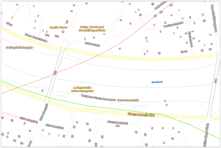
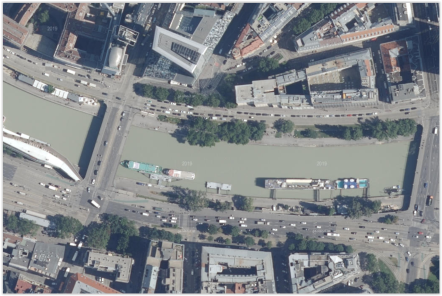
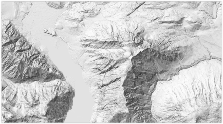
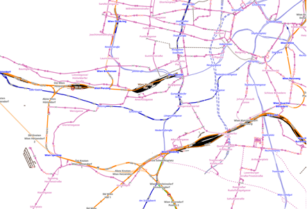
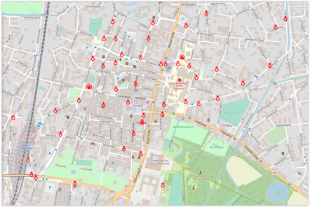
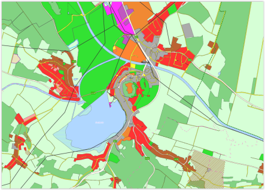
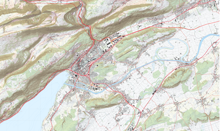
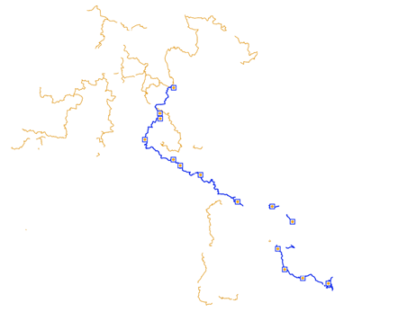

# **Online maps**

In the chapter "**Map Management**" the integration of online and offline maps by the user is explained.

Below you will find the **inputs**, which can be used in **step 1 (enter URL)** and in **step 4 ("naming")** for online maps **available for free on the Internet**, so that you can include them in ODIN and show the "origin" of the map:

## **Basemap**

| URL:                                                         | https://www.basemap.at/wmts/1.0.0/WMTSCapabilities.xml     |
| ------------------------------------------------------------ | ---------------------------------------------------------- |
| Select in step 2:                                            | Geoland Basemap –  Basemap of Austria in color             |
|                                                              |                                                            |
| **„Source“/specify provider**:                               | https://www.basemap.at/                                    |
| In step 4, copy the following text into the field **„Attributions“**: | `Map: <a href="https://basemap.at/#lizenz">basemap.at</a>` |
|                                                              |                                                            |
| **Map content**:                                             | Austria map in color                                       |
|                                                              |                                                            |
| **Preview image:**                                           |                               |

| URL:                                                         | https://www.basemap.at/wmts/1.0.0/WMTSCapabilities.xml       |
| ------------------------------------------------------------ | ------------------------------------------------------------ |
| Select in step 2:                                            | Geoland Basemap Overlay –  Basemap of Austria only labeling as transparent layer |
|                                                              |                                                              |
| **„Source“/specify provider**:                               | https://www.basemap.at/                                      |
| In step 4, copy the following text into the field **„Attributions“**: | `Map: <a href="https://basemap.at/#lizenz">basemap.at</a>`   |
|                                                              |                                                              |
| **Map content**:                                             | Transparent layer with designations (e.g. administrative borders,  place and street names,  house numbers, subway lines, water names,  mountain peaks, monuments etc.) |
|                                                              |                                                              |
| **Preview image**:                                           |                   |

| URL:                                                         | https://www.basemap.at/wmts/1.0.0/WMTSCapabilities.xml     |
| ------------------------------------------------------------ | ---------------------------------------------------------- |
| Select in step 2:                                            | Geoland Basemap –  Basemap of Austria in gray              |
|                                                              |                                                            |
| **„Source“/specify provider**:                               | https://www.basemap.at/                                    |
| In step 4, copy the following text into the field **„Attributions“**: | `Map: <a href="https://basemap.at/#lizenz">basemap.at</a>` |
|                                                              |                                                            |
| **Map content**:                                             | Austria map in gray                                        |
|                                                              |                                                            |
| **Preview image**:                                           |                                |

| URL:                                                         | https://www.basemap.at/wmts/1.0.0/WMTSCapabilities.xml       |
| ------------------------------------------------------------ | ------------------------------------------------------------ |
| Select in step 2:                                            | Basemap High DPl – Basemap with 512x512px tiles for support of user devices with high dpi display (iPad retina, smartphones with HD resolution) |
|                                                              |                                                              |
| **„Source“/specify provider**:                               | https://www.basemap.at/                                      |
| In step 4, copy the following text into the field **„Attributions“**: | `Map: <a href="https://basemap.at/#lizenz">basemap.at</a>`   |
|                                                              |                                                              |
| **Map content**:                                             | Austria map in color (HDPI) for devices with HDPI display    |
|                                                              |                                                              |
| **Preview image**:                                           |                            |

| URL:                                                         | https://www.basemap.at/wmts/1.0.0/WMTSCapabilities.xml     |
| ------------------------------------------------------------ | ---------------------------------------------------------- |
| Select in step 2:                                            | Geoland Basemap Orthofoto – Basemap as colored orthophoto  |
|                                                              |                                                            |
| **„Source“/specify provider**:                               | https://www.basemap.at/                                    |
| In step 4, copy the following text into the field **„Attributions“**: | `Map: <a href="https://basemap.at/#lizenz">basemap.at</a>` |
|                                                              |                                                            |
| **Map content**:                                             | Austria map as colored orthophoto                          |
|                                                              |                                                            |
| **Preview image**:                                           |                               |

| URL:                                                         | https://www.basemap.at/wmts/1.0.0/WMTSCapabilities.xml       |
| ------------------------------------------------------------ | ------------------------------------------------------------ |
| Select in step 2:                                            | Geoland Basemap Gelände – Basemap terrain view  of Austria in gray color |
|                                                              |                                                              |
| **„Source“/specify provider**:                               | https://www.basemap.at/                                      |
| In step 4, copy the following text into the field **„Attributions“**: | `Map: <a href="https://basemap.at/#lizenz">basemap.at</a>`   |
|                                                              |                                                              |
| **Map content**:                                             | Austria map with terrain representation (in gray)            |
|                                                              |                                                              |
| **Preview image**:                                           |                         |

| URL:                                                         | https://www.basemap.at/wmts/1.0.0/WMTSCapabilities.xml       |
| ------------------------------------------------------------ | ------------------------------------------------------------ |
| Select in step 2:                                            | Geoland Basemap Oberfläche – Basemap surface representation of Austria in gray |
|                                                              |                                                              |
| **„Source“/specify provider**:                               | https://www.basemap.at/                                      |
| In step 4, copy the following text into the field **„Attributions“**: | `Map: <a href="https://basemap.at/#lizenz">basemap.at</a>`   |
|                                                              |                                                              |
| **Map content**:                                             | Austria map with surface representation (in gray)            |
|                                                              |                                                              |
| **Preview image**:                                           |                         |

## **OpenTopoMap**

| URL:                                                         | https://tile.opentopomap.org/{z}/{x}/{y}.png                 |
| ------------------------------------------------------------ | ------------------------------------------------------------ |
|                                                              |                                                              |
| **„Source“/specify provider**:                               | https://opentopomap.org/about                                |
| In step 4, copy the following text into the field **„Attributions“**: | `Map: <a href="https://www.opentopomap.org/about">opentopomap.org</a>` |
|                                                              |                                                              |
| **Map content**:                                             | Topographic map generated from OpenStreetMap data and SRTM elevation data |
|                                                              |                                                              |
| **Preview image**:                                           |                                   |

## **OpenSlopeMap**

| URL:                                                         | https://wmts.openslopemap.org/wmts                           |
| ------------------------------------------------------------ | ------------------------------------------------------------ |
|                                                              |                                                              |
| **„Source“/specify provider**:                               | [https://www.openslopemap.org](https://www.openslopemap.org/) |
| In step 4, copy the following text into the field **„Attributions“**: | `Map: <a href="https://www.openslopemap.org/projekt/lizenzen/">OpenSlopeMap.at</a>` |
|                                                              |                                                              |
| **Map content**:                                             | currently 26 map sets for different areas in the alpine region and  the Pyrenees available (slope gradients, contour lines) |
|                                                              |                                                              |
| **Preview image**:                                           |                                  |

## **OpenFlightMap**

| URL:                                                         | https://snapshots.openflightmaps.org/live/1712/tiles/world/noninteractive/epsg3857/merged/512/latest/{z}/{x}/{y}.png |
| ------------------------------------------------------------ | ------------------------------------------------------------ |
|                                                              |                                                              |
| **„Source“/specify provider**:                               | [www.openflightmap.org](http://www.openflightmap.org)        |
| In step 4, copy the following text into the field **„Attributions“**: | `Map: <a href="https://www.openflightmaps.org/">openflightmap.org</a>` |
|                                                              |                                                              |
| **Map content**:                                             | Fade in of the airspace order in the European area           |
|                                                              |                                                              |
| **Preview image**:                                           |                                 |

## **OpenRailwayMap**

| URL:                                                         | http://tiles.openrailwaymap.org/standard/{z}/{x}/{y}.png     |
| ------------------------------------------------------------ | ------------------------------------------------------------ |
|                                                              |                                                              |
| **„Source“/specify provider**:                               | [www.openrailwaymap.org](http://www.openrailwaymap.org)      |
| In step 4, copy the following text into the field **„Attributions“**: | `Map: <a href="https://www.openrailwaymap.org/imprint-de.html">openrailwaymap.org</a>` |
|                                                              |                                                              |
| **Map content**:                                             | Fade in of railroad and subway lines, stations, etc.         |
|                                                              |                                                              |
| **Preview image**:                                           |                       |

| URL:                                                         | http://tiles.openrailwaymap.org/signals/{z}/{x}/{y}.png      |
| ------------------------------------------------------------ | ------------------------------------------------------------ |
|                                                              |                                                              |
| **„Source“/specify provider**:                               | [www.openrailwaymap.org](http://www.openrailwaymap.org)      |
| In step 4, copy the following text into the field **„Attributions“**: | `Map: <a href="https://www.openrailwaymap.org/imprint-de.html">openrailwaymap.org</a>` |
|                                                              |                                                              |
| **Map content**:                                             | Fade in of the signal systems for rail traffic               |
|                                                              |                                                              |
| **Preview image**:                                           |                        |

| URL:                                                         | http://tiles.openrailwaymap.org/maxspeed/{z}/{x}/{y}.png     |
| ------------------------------------------------------------ | ------------------------------------------------------------ |
|                                                              |                                                              |
| **„Source“/specify provider**:                               | [www.openrailwaymap.org](http://www.openrailwaymap.org)      |
| In step 4, copy the following text into the field **„Attributions“**: | `Map: <a href="https://www.openrailwaymap.org/imprint-de.html">openrailwaymap.org</a>` |
|                                                              |                                                              |
| **Map content**:                                             | Fade in the speed ranges for rail traffic                    |
|                                                              |                                                              |
| **Preview image**:                                           |                       |

## **OpenSeaMap**

| URL:                                                         | http://t1.openseamap.org/seamark/{z}/{x}/{y}.png             |
| ------------------------------------------------------------ | ------------------------------------------------------------ |
|                                                              |                                                              |
| **„Source“/specify provider**:                               | [www.openseamap.org](http://www.openseamap.org)              |
| In step 4, copy the following text into the field **„Attributions“**: | `Map: <a href="https://www.openseamap.org/index.php?id=imprint">openseamap.org</a>` |
|                                                              |                                                              |
| **Map content**:                                             | Fade in of maritime data (e.g. ports, beacons, corridors etc.) |
|                                                              |                                                              |
| **Preview image**:                                           |                                    |

## **OpenFireMap**

| URL:                                                         | http://openfiremap.org/hytiles/{z}/{x}/{y}.png               |
| ------------------------------------------------------------ | ------------------------------------------------------------ |
|                                                              |                                                              |
| **„Source“/specify provider**:                               | [www.openfiremap.org](http://www.openfiremap.org)            |
| In step 4, copy the following text into the field **„Attributions“**: | `Map: <a href="https://www.openstreetmap.org/copyright">Open Street Map - Mitwirkende</a>` |
|                                                              |                                                              |
| **Map content**:                                             | Fade in of fire department bases, hydrants etc. (if available in openfiremap) |
|                                                              |                                                              |
| **Preview image**:                                           |                                   |

## **OpenSnowMap**

| URL:                                                         | http://www.opensnowmap.org/pistes/{z}/{x}/{y}.png            |
| ------------------------------------------------------------ | ------------------------------------------------------------ |
|                                                              |                                                              |
| **„Source“/specify provider**:                               | [www.opensnowmap.org](http://www.opensnowmap.org)            |
| In step 4, copy the following text into the field **„Attributions“**: | `Map: <a href="https://www.openstreetmap.org/copyright">Open Street Map - Mitwirkende</a>` |
|                                                              |                                                              |
| **Map content**:                                             | Fade in of winter sports facilities (worldwide)              |
|                                                              |                                                              |
| **Preview image**:                                           |                                   |

## **Stamen**

| URL:                                                         | http://tile.stamen.com/toner/{z}/{x}/{y}.png                 |
| ------------------------------------------------------------ | ------------------------------------------------------------ |
|                                                              |                                                              |
| **„Source“/specify provider**:                               | https://stamen.com/open-source                               |
| In step 4, copy the following text into the field **„Attributions“**: | `Map: <a href="https://stamen.com/privacy-policy">stamen.com</a>` |
|                                                              |                                                              |
| **Map content**:                                             | Black and white map                                          |
|                                                              |                                                              |
| **Preview image**:                                           |                                  |

| URL:                                                         | http://tile.stamen.com/terrain/{z}/{x}/{y}.jpg               |
| ------------------------------------------------------------ | ------------------------------------------------------------ |
|                                                              |                                                              |
| **„Source“/specify provider**:                               | https://stamen.com/open-source                               |
| In step 4, copy the following text into the field **„Attributions“**: | `Map: <a href="https://stamen.com/privacy-policy">stamen.com</a>` |
|                                                              |                                                              |
| **Map content**:                                             | Map showing terrain with hill shading and natural vegetation colors |
|                                                              |                                                              |
| **Preview image**:                                           |                                |

| URL:                                                         | http://tile.stamen.com/watercolor/{z}/{x}/{y}.jpg            |
| ------------------------------------------------------------ | ------------------------------------------------------------ |
|                                                              |                                                              |
| **„Source“/specify provider**:                               | https://stamen.com/open-source                               |
| In step 4, copy the following text into the field **„Attributions“**: | `Map: <a href="https://stamen.com/privacy-policy">stamen.com</a>` |
|                                                              |                                                              |
| **Map content**:                                             | Watercolor map with raster effects                           |
|                                                              |                                                              |
| **Preview image**:                                           |                             |

## **GIS map Burgenland**

| URL:                                                         | https://gis.bgld.gv.at/gisbgld/rest/services/Public/Grundkarte/MapServer/WMTS/1.0.0/WMTSCapabilities.xml |
| ------------------------------------------------------------ | ------------------------------------------------------------ |
|                                                              |                                                              |
| **„Source“/specify provider**:                               | https://gis.bgld.gv.at                                       |
| In step 4, copy the following text into the field **„Attributions“**: | `Map: <a href="https://geodaten.bgld.gv.at/de/allg-informationen/nutzungsbedingungen.html"“>geodaten.bgld.gv.at</a>` |
|                                                              |                                                              |
| **Map content**:                                             | Map of Burgenland with geodatas (e.g. roads, waters, public services, real estate etc.) |
|                                                              |                                                              |
| **Preview image**:                                           |                                      |

## **SwissTopo**

| URL:                                                         | http://wmts.geo.admin.ch/1.0.0/WMTSCapabilities.xml          |
| ------------------------------------------------------------ | ------------------------------------------------------------ |
| Select in step 2:                                            | select one of the currently 506 available maps               |
|                                                              |                                                              |
| **„Source“/specify provider**:                               | [www.swisstopo.admin.ch](http://www.swisstopo.admin.ch)      |
| In step 4, copy the following text into the field **„Attributions“**: | `Map: <a href="https://www.admin.ch/gov/de/start/rechtliches.html">geo.admin.ch</a>` |
|                                                              |                                                              |
| **Map content**:                                             | e.g., vegetation, roads, cultural assets, water bodies, administrative boundaries,  cell phone exposure, energy, noise pollution, protected areas, plant distribution, etc.) |
|                                                              |                                                              |
| **Preview image**:                                           |                                     |

## **ÖPNV-Map**

| URL:                                                         | http://tile.memomaps.de/tilegen/{z}/{x}/{y}.png              |
| ------------------------------------------------------------ | ------------------------------------------------------------ |
|                                                              |                                                              |
| **„Source“/specify provider**:                               | http://www.öpnvkarte.de                                      |
| In step 4, copy the following text into the field **„Attributions“**: | `Map: <a href="http://www.öpnvkarte.de">memomaps.de/Open Street Map - Mitwirkende</a>` |
|                                                              |                                                              |
| **Map content**:                                             | Map with transport routes (roads, railroads, subways, buses, ferries etc.) and transfer points (airports, stops etc.) |
|                                                              |                                                              |
| **Preview image**:                                           |                                         |

## **WayMarketTrails**

| URL:                                                         | https://tile.waymarkedtrails.org/hiking/{z}/{x}/{y}.png      |
| ------------------------------------------------------------ | ------------------------------------------------------------ |
|                                                              |                                                              |
| **„Source“/specify provider**:                               | [www.waymarkedtrails.org](http://www.waymarkedtrails.org)    |
| In step 4, copy the following text into the field **„Attributions“**: | `Map: <a href="https://hiking.waymarkedtrails.org/help/legal">waymarkedtrails.org</a>` |
|                                                              |                                                              |
| **Map content**:                                             | Fade in of marked hiking trails and locations of signposts (emphasis on Europe,  some worldwide) *Will be extended permanently!* |
|                                                              |                                                              |
| **Preview image**:                                           |                           |

| URL:                                                         | https://tile.waymarkedtrails.org/cycling/{z}/{x}/{y}.png     |
| ------------------------------------------------------------ | ------------------------------------------------------------ |
|                                                              |                                                              |
| **„Source“/specify provider**:                               | [www.waymarkedtrails.org](http://www.waymarkedtrails.org)    |
| In step 4, copy the following text into the field **„Attributions“**: | `Map: <a href="https://cycling.waymarkedtrails.org/help/legal">waymarkedtrails.org</a>` |
|                                                              |                                                              |
| **Map content**:                                             | Fade in of marked bike paths/bike routes (emphasis on Europe, some worldwide) *Will be extended permanently!* |
|                                                              |                                                              |
| **Preview image**:                                           |                          |

| URL:                                                         | https://tile.waymarkedtrails.org/mtb/{z}/{x}/{y}.png         |
| ------------------------------------------------------------ | ------------------------------------------------------------ |
|                                                              |                                                              |
| **„Source“/specify provider**:                               | [www.waymarkedtrails.org](http://www.waymarkedtrails.org)    |
| In step 4, copy the following text into the field **„Attributions“**: | `Map: <a href="https://mtb.waymarkedtrails.org/help/legal">waymarkedtrails.org</a>` |
|                                                              |                                                              |
| **Map content**:                                             | Fade in marked mountain bike routes (not many worldwide yet) *Will be extended permanently!* |
|                                                              |                                                              |
| **Preview image**:                                           |                              |

| URL:                                                         | https://tile.waymarkedtrails.org/riding/{z}/{x}/{y}.png      |
| ------------------------------------------------------------ | ------------------------------------------------------------ |
|                                                              |                                                              |
| **„Source“/specify provider**:                               | [www.waymarkedtrails.org](http://www.waymarkedtrails.org)    |
| In step 4, copy the following text into the field **„Attributions“**: | `Map: <a href="https://riding.waymarkedtrails.org/help/legal">waymarkedtrails.org</a>` |
|                                                              |                                                              |
| **Map content**:                                             | Fade in of marked horse riding trails/routes (not yet many worldwide) *Will be extended permanently!* |
|                                                              |                                                              |
| **Preview image**:                                           |                           |

| URL:                                                         | https://tile.waymarkedtrails.org/skating/{z}/{x}/{y}.png     |
| ------------------------------------------------------------ | ------------------------------------------------------------ |
|                                                              |                                                              |
| **„Source“/specify provider**:                               | [www.waymarkedtrails.org](http://www.waymarkedtrails.org)    |
| In step 4, copy the following text into the field **„Attributions“**: | `Map: <a href="https://skating.waymarkedtrails.org/help/legal">waymarkedtrails.org</a>` |
|                                                              |                                                              |
| **Map content**:                                             | Fade in of marked routes for inline skating (currently only a few in Switzerland) *Will be extended permanently!* |
|                                                              |                                                              |
| **Preview image**:                                           |                          |

| URL:                                                         | https://tile.waymarkedtrails.org/slopes/{z}/{x}/{y}.png      |
| ------------------------------------------------------------ | ------------------------------------------------------------ |
|                                                              |                                                              |
| **„Source“/specify provider**:                               | [www.waymarkedtrails.org](http://www.waymarkedtrails.org)    |
| In step 4, copy the following text into the field **„Attributions“**: | `Map: <a href="https://slopes.waymarkedtrails.org/help/legal">waymarkedtrails.org</a>` |
|                                                              |                                                              |
| **Map content**:                                             | Fade in marked winter sports slopes (worldwide) *Will be extended permanently!* |
|                                                              |                                                              |
| **Preview image**:                                           |                           |
